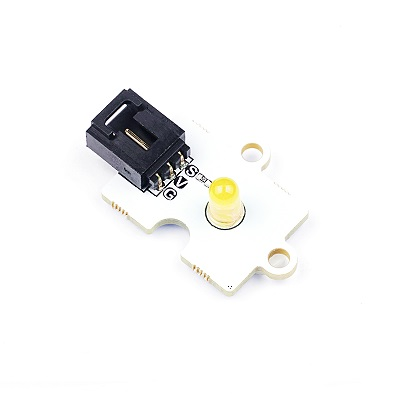
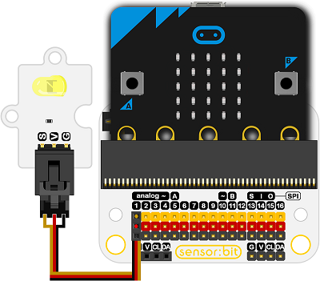

# 黄色圆形LED

## 简介
Octopus 5mmLED灯模块，能和micro:bit/Arduino扩展板搭配,实现调整环境光的功能。

 

## 特性
---
- 三线端口设计，防止误插，易于使用。

## 技术规格
---

项目 | 参数 
:-: | :-: 
电压|3.3V~5V
重量|5克
SKU|EF04066

## 外形与定位尺寸
---

 

## 快速上手
---
### 所需器材及连接示意图
- 如下图所示，连接扩展板的P1口

***以sensor：bit为例***




### 如图所示编写程序
向P0引脚中每隔一秒钟写入1或0


### 参考程序

请参考程序连接：[https://makecode.microbit.org/_J82V5PgzghKR](https://makecode.microbit.org/_J82V5PgzghKR)

你也可以通过以下网页直接下载程序，下载完成后即可开始运行程序。

<div style="position:relative;height:0;padding-bottom:70%;overflow:hidden;"><iframe style="position:absolute;top:0;left:0;width:100%;height:100%;" src="https://makecode.microbit.org/#pub:_J82V5PgzghKR" frameborder="0" sandbox="allow-popups allow-forms allow-scripts allow-same-origin"></iframe></div>  
---

### 结果
- led灯一秒钟闪一次

## Python 编程

### 步骤 1
下载压缩包并解压[Octopus_MicroPython-master](https://github.com/lionyhw/Octopus_MicroPython/archive/master.zip)
打开[Python editor](https://python.microbit.org/v/2.0)


为了给LED灯编程，我们需要添加led.py。点击Load/Save，然后点击Show Files（1）下拉菜单，再点击Add file在本地找到下载并解压完成的Octopus_MicroPython-master文件夹，从中选择led.py添加进来。


### 步骤 2
### 参考程序
```
from microbit import *
from led import *

l = LED(pin1)
while True:
    l.set_led(1,100)
    sleep(500)
    l.set_led(0,0)
    sleep(500)
```


### 结果
- LED灯每秒闪烁一次。


## 相关案例
---

## 技术文档
---
