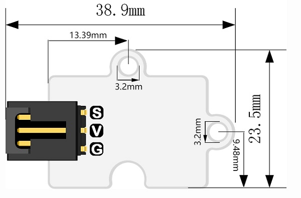
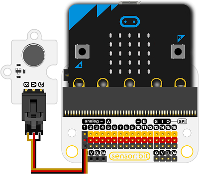

# 震动电机电子积木

## 简介
---
OCTOPUS振动电机电子模块，带有一个由高压驱动的小型振动器。 它可以用作玩具，手机等产品的振动器。

 

## 特性
---
- 三线端口防止错误插拔，易于使用。

## 技术规格
---

项目 | 参数 
:-: | :-: 
SKU|EF04074
电压|+ 3.3-5V
重量|5克
功耗|低功耗
额定电流|80mA（MAX）
工作温度|-20~70℃
尺寸|31.28mm×23.48mm

## 外形与定位尺寸
---

## 快速上手
---
### 所需器材及连接示意图
- 如图连接扩展板的P1口

***以sensor:bit为例***

### 添加Package

### 如图所示编写程序

### 参考程序
请参考程序连接：[https://makecode.microbit.org/_K3ydU0V389k2](https://makecode.microbit.org/_K3ydU0V389k2)

你也可以通过以下网页直接下载程序，下载完成后即可开始运行程序。

<iframe style="position:absolute;top:0;left:0;width:100%;height:100%;" src="https://makecode.microbit.org/#pub:_K3ydU0V389k2" frameborder="0" sandbox="allow-popups allow-forms allow-scripts allow-same-origin"></iframe>
  
---

### 结果
- 按下A键模块开始振动

## 相关案例
---

## 技术文档
---
