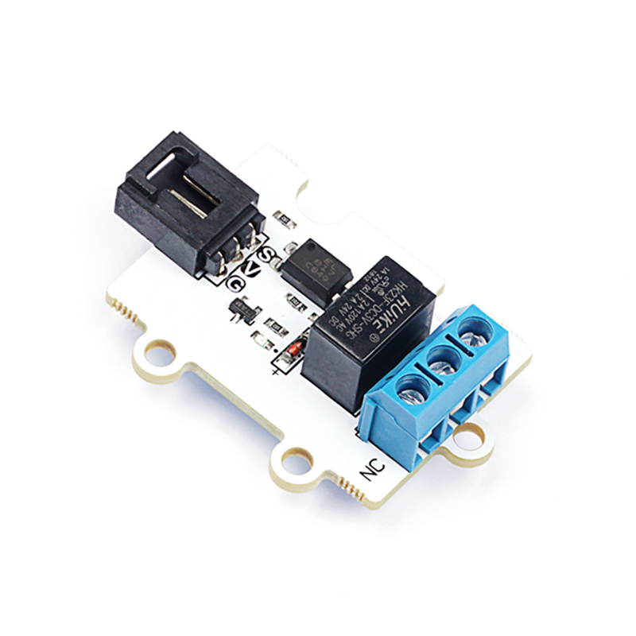

# 3V 继电器电子积木

## 简介
---

1 Channel Relay 3V Relay Module 是我们OCTOPUS系列的一路继电器电子积木，它的基本设计是根据OCTOPUS电子积木系列设定的，它的外形、PCB固定孔、电子积木的接口的设定是相同的。OCTOPUS 1 Channel Relay采用超小、高质量HUIKE继电器，可以控制各种家用电器，及大电流负载。是电子爱好者的DIY的常用配件模块。

## 特性 
---
- 采用大电流继电器，最高电流可达30A。
- 采用3V供电，可支持micro:bit。
- 触点控制，包含一个常开触点与一个常闭触点。
- 接线方便。

## 参数
---

项目 | 参数 
:-: | :-: 
品名|1 Channel Relay 3V Relay Module
版本号|V1.0
SKU| EF04086
工作电压|DC 3~5.5V
尺寸|38x27mm
触点负载|交流250V-3A 直流30V-3A
净重|8.5g

### 外型与定位尺寸  

## 快速上手  
---  
### 硬件连接  

将模块通过带扣杜邦线插入octopus:bit上的P1引脚，将micro:bit主板插入octopus:bit。

### 参考程序

请参考程序连接：[https://makecode.microbit.org/_J82V5PgzghKR](https://makecode.microbit.org/_J82V5PgzghKR)

你也可以通过以下网页直接下载程序，下载完成后即可开始运行程序。

<iframe style="position:absolute;top:0;left:0;width:100%;height:100%;" src="https://makecode.microbit.org/#pub:_J82V5PgzghKR" frameborder="0" sandbox="allow-popups allow-forms allow-scripts allow-same-origin"></iframe>
  
---

### 结果  
按下按钮A，写入0，NC（常闭触点导通）
按下按钮B，写入1，NO（常开触点导通）
常开触点吸合，常闭触点断开。

## 常见问题
