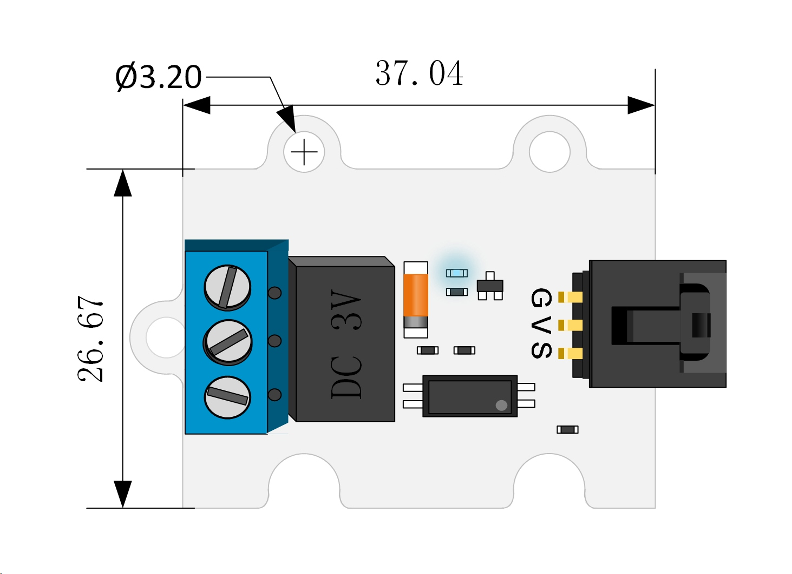
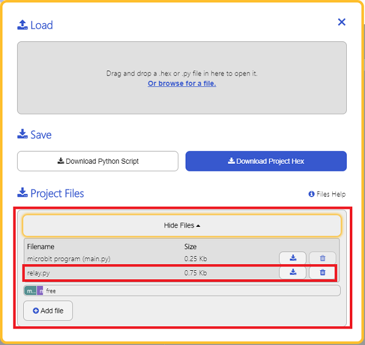

# 3V 继电器电子积木

## 简介
---

1 Channel Relay 3V Relay Module 是我们OCTOPUS系列的一路继电器电子积木，它的基本设计是根据OCTOPUS电子积木系列设定的，它的外形、PCB固定孔、电子积木的接口的设定是相同的。OCTOPUS 1 Channel Relay采用超小、高质量HUIKE继电器，可以控制各种家用电器，及大电流负载。是电子爱好者的DIY的常用配件模块。


## 特性 
---
- 采用大电流继电器，最高电流可达2A。
- 采用3V供电，可支持micro:bit。
- 触点控制，包含一个常开触点NO与一个常闭触点NC。
- 接线方便。

## 参数
---

项目 | 参数 
:-: | :-: 
品名|1 Channel Relay 3V Relay Module
版本号|V1.0
SKU| EF04086
工作电压|DC 3~5.5V
尺寸|38x27mm
触点负载|DC 24V 2A，AC 120V 2A
净重|8.5g

### 外型与定位尺寸  





## 快速上手  
---  
### 硬件连接  

将模块通过带扣杜邦线插入octopus:bit上的P1引脚，将micro:bit主板插入octopus:bit。将继电器中间的共用脚连接到电源上，将水泵的电源线连接到继电器的常开触点NO上（默认情况下NO触点不导通，当通过micro:bit向继电器连接的引脚写入1时，NO触点才导通），将水泵的地线接地。


硬件连线时，应使用配套螺丝刀将继电器端子上的螺丝拧松。


### 参考程序

请参考程序连接：[https://makecode.microbit.org/_017APbboED6M](https://makecode.microbit.org/_017APbboED6M)

你也可以通过以下网页直接下载程序，下载完成后即可开始运行程序。

<div style="position:relative;height:0;padding-bottom:70%;overflow:hidden;"><iframe style="position:absolute;top:0;left:0;width:100%;height:100%;" src="https://makecode.microbit.org/#pub:_017APbboED6M" frameborder="0" sandbox="allow-popups allow-forms allow-scripts allow-same-origin"></iframe></div>  
---

### 结果  
按下按钮A，写入1，NO（常开触点导通），水泵开始工作

按下按钮B，写入0，NC（常闭触点导通），水泵停止工作

常开触点吸合，常闭触点断开。


## Python 编程

### 步骤 1
下载压缩包并解压[Octopus_MicroPython-master](https://github.com/lionyhw/Octopus_MicroPython/archive/master.zip)
打开[Python editor](https://python.microbit.org/v/2.0)


为了给3V继电器编程，我们需要添加relay.py。点击Load/Save，然后点击Show Files（1）下拉菜单，再点击Add file在本地找到下载并解压完成的Octopus_MicroPython-master文件夹，从中选择relay.py添加进来。




### 步骤 2
### 参考程序
```
from microbit import *
from relay import *

l = RELAY(pin1)
while True:
    l.set_relay(1)
    sleep(1000)
    l.set_relay(0)
    sleep(1000)
```


### 结果
- 继电器每一秒切换一次状态。


## 常见问题
