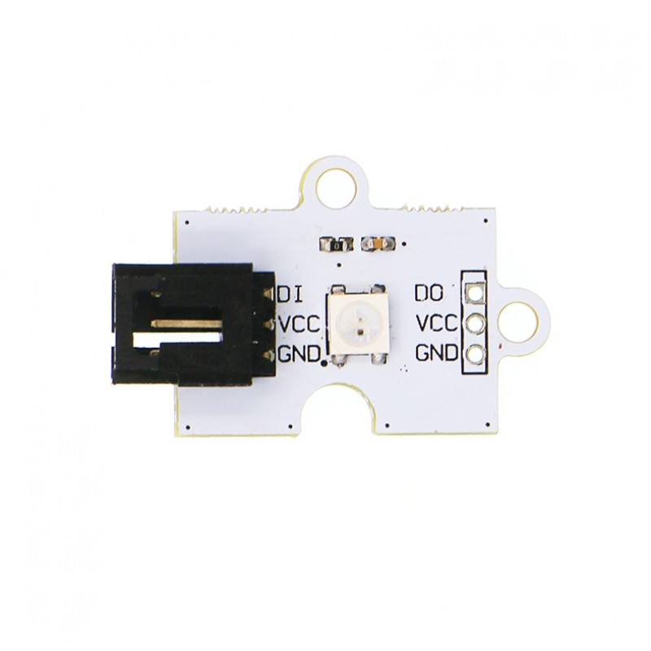
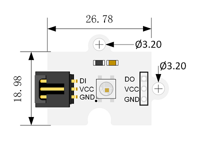
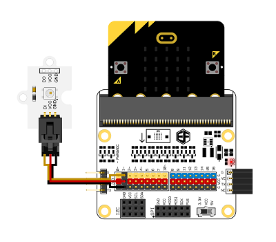

# 单颗彩虹LED电子积木

## 简介
---
Octopus Single RGB Rainbow LED是我们OCTOPUS系列的单颗彩虹LED电子积木，它的基本设计是根据OCTOPUS电子积木系列设定的，它的外形、PCB固定孔、电子积木的接口的设定是相同的。板载的LED是一个集控制电路与发光电路与一体的智能外控led，具有低电压驱动、亮度高、散射角度大等优点。 

## 特性 
---

- 单线数据传输，可无限级连。
- 灰度调节电路（256级灰度可调）。
- 内置上电复位和掉电复位电路，上电不亮灯。
- 红光驱动特殊处理，配色更均衡。
- 数据传输频率可达800Kbps,当刷新速率30帧/秒时，级联数不小于1024点。

## 参数
---

项目 | 参数 
:-: | :-: 
品名|Octopus Single RGB Rainbow LED
版本号|V1.2
SKU|EF04091
工作电压|DC 3.3~5.5V
工作温度|-40~+85摄氏度
尺寸|27x19mm
净重|2.4g

### 外型与定位尺寸  

## 快速上手  
---  

### 硬件连接  
连线说明：将该模块连接在OCTOPUS:BIT扩展板的P1口上，将micro:bit主板插入OCTOPUS:BIT扩展板。

### 软件编程  
打开makecode,在MakeCode的代码抽屉中点击“高级"，查看更多代码选项。

为了给该模块编程，我们需要添加一个代码库。在代码抽屉底部找到“扩展”，并点击它。这时会弹出一个对话框。搜索“neopixel"，然后点击下载这个代码库,下图红色箭头所指为代码库。

### 参考程序

请参考程序连接：[https://makecode.microbit.org/_FH59EbdYFT6W](https://makecode.microbit.org/_FH59EbdYFT6W)

你也可以通过以下网页直接下载程序，下载完成后即可开始运行程序。

<iframe style="position:absolute;top:0;left:0;width:100%;height:100%;" src="https://makecode.microbit.org/#pub:_FH59EbdYFT6W" frameborder="0" sandbox="allow-popups allow-forms allow-scripts allow-same-origin"></iframe>
  
---

### 结果  

Rainbow Led循环显示红，绿，蓝三种颜色。

## 常见问题
