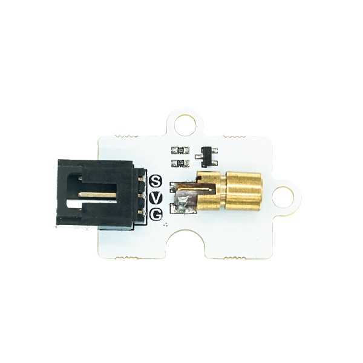

# 激光头电子积木

## 简介
---

Octopus 3V laser sensor是我们OCTOPUS系列的激光发射电子积木，它的基本设计是根据OCTOPUS电子积木系列设定的，它的外形、PCB固定孔、电子积木的接口的设定是相同的。

由具有发射光芯，聚光透镜，可调套筒三部分组成，可以直接通电就可以使用。

特殊说明：请勿照射人的眼睛，此激光头发射的是红色激光束，只有在有雾或其他介质的前提下才能看到微弱的红线，而通常情况下看到的是一个红点。

## 特性 
---
- 激光的发射原理及产生过程的特殊性决定了激光具有普通光所不具有的特点：即三好（单色性好、相干性好、方向性好）一高（亮度高）。
- 采用3V供电，可支持micro:bit。
- 接线方便。

## 参数
---

- 品名：激光头电子积木
- SKU：EF04096
- 工作电压：DC 3~5.5V
- 波长：650NM
- 功率：5MW
- 光点大小：15米处光点为φ10mm ~ φ15mm
- 连接模式：G-GND，V-VCC，S-信号引脚
- 尺寸：38.9x23.5mm
- 净重|5g

### 外型与定位尺寸  

## 快速上手  
---  
### 硬件连接  

将模块通过带扣杜邦线插入octopus:bit上的P1引脚，将micro:bit主板插入octopus:bit。

### 软件编程  

打开makecode，编写程序向P1口写入高电平，发射激光，写入0，停止发射。
程序代码链接：[https://makecode.microbit.org/_Lvega7TP6ggz](https://makecode.microbit.org/_Lvega7TP6ggz)

你也能通过下列窗口直接下载代码

 <iframe style="position:absolute;top:0;left:0;width:100%;height:100%;" 
         src="https://makecode.microbit.org/#pub:_J82V5PgzghKR" frameborder="0" sandbox="allow-popups allow-forms allow-scripts allow-same-origin">
 </iframe>

  

### 结果  

激光头点亮1秒熄灭1秒。

## 常见问题
