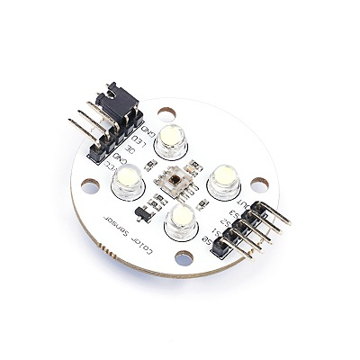
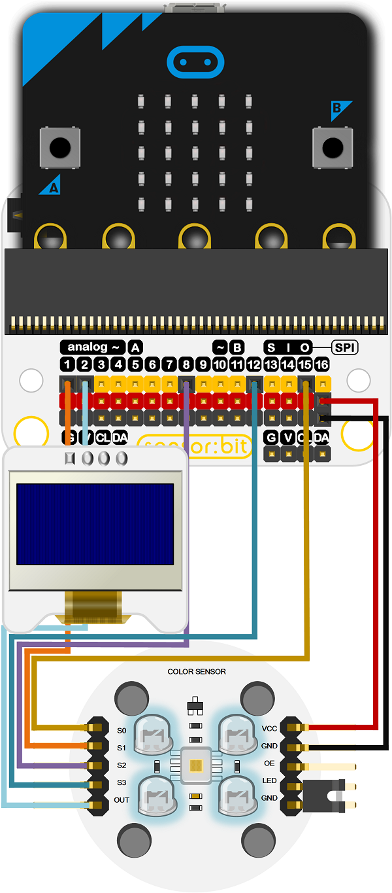

# 颜色识别传感器

## 简介
---

色彩传感器模块基于TCS3200，它是一个可编程的彩色光电转换器，它可以过滤来自光源的RGB数据并将其转换为方波（50％占空比），其频率与光强度成正比（光照幅度）。满量程输出频率可通过两个控制输入引脚（SO，S1可选选项2％，20％，100％频率）按三个预设值之一进行缩放，而引脚S2，S3控制RGB滤波器。数字输入和数字输出允许直接连接到micro:bit或其他逻辑电路。输出使能（OE）将输出置于高阻态，以便多单元共享微控制器输入线。最后，用户可以通过RGB值计算光的颜色。

## 特性 
---
- 光强度与频率的高分辨率转换
- 可编程颜色和满量程输出频率
- 与micro:bit直接通信
- 单电源供电（2.7 V至5.5 V）
- 非线性误差在50 kHz时通常为0.2％
- 稳定的200 ppm /°C温度系数

## 参数
---
- 品名：色彩传感器模块电子积木
- SKU：EF03047
- 工作电压：DC 2.7~5.5V
- 连接模式：G-GND，V-VCC，S-信号引脚
- 尺寸：37.6 x 37.6mm
- 净重：5.1g

## 外型与定位尺寸  
---

## 快速上手  
---  
### 硬件连接  

将模块S0连接到P15口，S1连接到P1，S2连接到P8，S3连接到P12，OUT连接到P2，VCC连接电源，GND连接接地。将micro:bit主板插入octopus:bit。
将OLED连接到IIC接口。

### 软件编程  

添加扩展[https://github.com/DoraLC/pxt-tcs3200-color-sensor](https://github.com/DoraLC/pxt-tcs3200-color-sensor)到makecode，在OLED上显示检测到的RGB值。

程序代码链接：[https://makecode.microbit.org/_JU5Dau19mE9c](https://makecode.microbit.org/_JU5Dau19mE9c)

你也能通过下列窗口直接下载代码

<iframe style="position:absolute;top:0;left:0;width:100%;height:100%;" src="https://makecode.microbit.org/#pub:_JU5Dau19mE9c" frameborder="0" sandbox="allow-popups allow-forms allow-scripts allow-same-origin"></iframe>

### 结果  

OLED显示屏显示当前红蓝绿的值。

## 常见问题

首次使用或重启或更换灯等，请调整WB（白平衡）