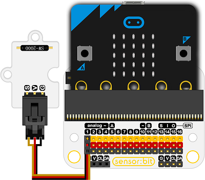

# 倾斜开关电子积木

## 简介
---
- 该倾斜度传感器是一种基于倾斜开关的传感器，用于测量物体是否水平。
 

## 特性
---
- 三线端口防止错误插拔，易于使用。
- 3V电压支持micro:bit驱动。

## 技术规格
---

项目 | 参数 
:-: | :-: 
SKU|EF04001
工作电压|DC 3.0V
电源需求|3v-5v
接口类型|数字
引脚定义|1-Signal 2-VCC 3-GND
响应|快速响应和高灵敏度
电路|简单的驱动电路
稳定性|稳定耐用

## 外形与定位尺寸
---
 

## 快速上手
---
### 连接示意图
- 如图连接扩展板的P1口。

***以sensor:bit为例***

 

### 如图编写程序代码
- 将P1口拉高以初始化模块。
- 当物体水平时返回值为0，数字读取引脚为0时，显示一颗心。
- 否则显示一个方框。

 

### 参考程序

请参考程序连接：[https://makecode.microbit.org/_WMwRtRXFe2tw](https://makecode.microbit.org/_WMwRtRXFe2tw)

你也可以通过以下网页直接下载程序，下载完成后即可开始运行程序。

<iframe style="position:absolute;top:0;left:0;width:100%;height:100%;" src="https://makecode.microbit.org/#pub:_WMwRtRXFe2tw" frameborder="0" sandbox="allow-popups allow-forms allow-scripts allow-same-origin"></iframe>
  
---

### 结果
- 当物体倾斜角度改变时，micro:bit显示器上显示心型或矩形图形。

## 相关案例
---

## 技术文档
---
 [Schematics](https://elecfreaks.com/estore/download/EF04001-tilt_SCH.pdf)
