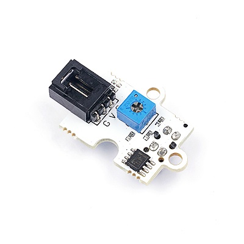
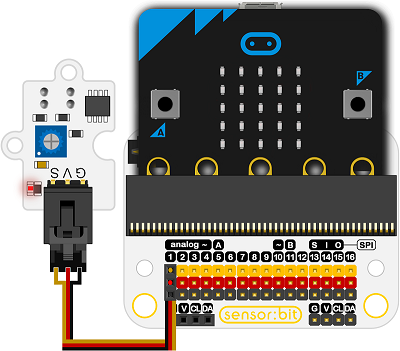

# 红外传感器电子积木

## 简介
---
- 红外超声波传感器是一种基于TCRT5000光电敏感元件的传感器，它可以灵敏地检测红外反射信号。

 

## 特性
---
- 三线端口防止错误插拔，易于使用。
-  3V电压支持micro:bit驱动

## 技术规格
---

项目 | 参数 
:-: | :-: 
SKU|EF04002
电源需求|3V-5V
接口类型|数字
引脚定义|1-Signal 2-VCC 3-GND
响应|快速响应和高灵敏度
电路|简单的驱动电路
稳定性|稳定耐用

## 外形与定位尺寸
---

 

## 快速上手
---
### 所需器材及连接示意图
- 如图连接扩展板的P1口。

***以sensor:bit为例***

 

### 如图所示编写程序
---
- 将P1口拉为高电平以初始化模块。
- 当检测到有物体靠近返回值为0，数字读取引脚为0时，显示一颗心。
- 否则显示一个方框。

 

### 参考程序

请参考程序连接：[https://makecode.microbit.org/_2vF4fKc5rdoP](https://makecode.microbit.org/_2vF4fKc5rdoP)

你也可以通过以下网页直接下载程序，下载完成后即可开始运行程序。

<iframe style="position:absolute;top:0;left:0;width:100%;height:100%;" src="https://makecode.microbit.org/#pub:_2vF4fKc5rdoP" frameborder="0" sandbox="allow-popups allow-forms allow-scripts allow-same-origin"></iframe>
  
---

### 结果
- 放在相对物体，距离大于9mm的位置显示一颗心型，放置在相对物体，距离小于9mm的位置显示矩形图案。

## 相关案例
---

## 技术文档
---
