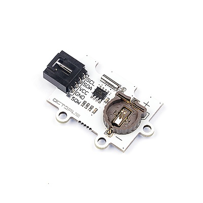
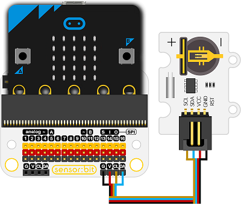

# RTC时钟电子积木

## 简介
---
- OCTOPUS实时时钟是一个时钟模块，可以通过使用DS1307时钟芯片实现年、月、日、小时的计数。

 

## 特性
---
- 该芯片具有很多优点、低电压、具有56字节大小的非易失性RAM时钟日历。
- 完整的BCD码实时时钟芯片，地址和数据通过双线双向串行总线传输、提供秒、分、小时等信息、自动调整每个月的天数。
- 更令人惊讶的是，芯片也具有闰年补偿功能。
- 芯片内置电源检测电路，支持掉电检测和电池切换功能。

## 技术规格
---

项目 | 参数 
:-: | :-: 
SKU|EF04005
接口|双线串行接口（IIC通信）
输出|可编程方波输出
检测|自动断电检测和开关电路
功耗|在备用电池模式下，功耗小于500nA
工业工作温度|-40至80℃
电源需求|3v-5v
接口类型|数字
引脚定义|1-GND 2-VCC 3-SCK 4-SDA 5-RST

## 快速上手
---

### 所需器材及连接示意图

- 如图所示，连接至iic接口。

***以sensor:bit为例***

 

### 添加Package
---
- 在MakeCode的代码抽屉中点击高级，查看更多代码选项。

 

- 点击“扩展”，在弹出的对话框中搜索“iot"，下载iot代码库。

 

 

### 如图所示编写程序
---
- 当开机时设置秒钟数为“10”，循环显示秒。每60秒循环一次。

 

### 参考程序
[https://makecode.microbit.org/_4aj9yohK5Rm1](https://makecode.microbit.org/_4aj9yohK5Rm1)

你也可以通过以下网页直接下载程序，下载完成后即可开始运行程序。

<iframe style="position:absolute;top:0;left:0;width:100%;height:100%;" src="https://makecode.microbit.org/#pub:_4aj9yohK5Rm1" frameborder="0" sandbox="allow-popups allow-forms allow-scripts allow-same-origin"></iframe>
  
---

### 结果
- micro:bit 点阵屏上显示当前秒钟数，每60秒循环一次。

## 相关案例
---

## 技术文档
---
