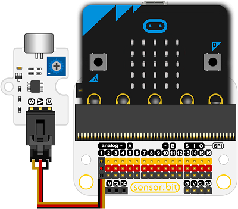

# 声音传感器电子积木

## 简介
---
- OCTOPUS声音传感器是一种基于MIC声音传感元件的传感器模块。声音传感器对声音强度特别敏感，它可用于检测环境声级，但无法识别声音的大小和特定的声音频率。 它可用于制作语音交换机和其他工作。

 

## 特性
---
- 三线端口防止错误插拔，易于使用。
- 3V电压支持micro:bit驱动

## 技术规格
---
项目 | 参数 
:-: | :-: 
SKU|EF04008
电源需求|3V-5.5V
接口类型|模拟
引脚定义|1-Signal 2-VCC 3-GND
响应|快速响应和高灵敏度
电路|简单的驱动电路
稳定性|稳定耐用

## 外形与定位尺寸
---
 

## 快速上手
---

### 所需器材及连接示意图
- 如图连接扩展板的P1口。

***以sensor:bit为例***

 

### 添加Package
- 在MakeCode的代码抽屉中点击Advanced，查看更多代码选项。

 

- 点击“Extensions”，在弹出的对话框中搜索“iot"，下载iot代码库。

 

 

### 如图所示编写程序
- 显示当前噪音分贝值。

 

### 参考程序
请参考程序连接：[https://makecode.microbit.org/_TzgHwu4jUAdy](https://makecode.microbit.org/_TzgHwu4jUAdy)
你也可以通过以下网页直接下载程序，下载完成后即可开始运行程序。

<iframe style="position:absolute;top:0;left:0;width:100%;height:100%;" src="https://makecode.microbit.org/#pub:_TzgHwu4jUAdy" frameborder="0" sandbox="allow-popups allow-forms allow-scripts allow-same-origin"></iframe>
  
---

### 结果
- micro:bit的点阵屏上显示出当前环境的噪声分贝大小。

## 相关案例
---

## 技术文档
---
