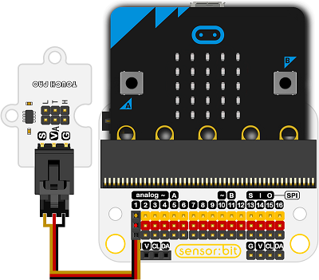

# 触摸传感器电子积木

## 简介
---
Touch PAD Brick是一种传感器模块，主要通过电容式触摸TTP223-BA6充电IC和压力体，陶瓷，玻璃等介电材料，并且电荷水平用于检测传感器模块触摸开关的微小变化

 

## 特性
---
- 三线端口防止错误插拔，易于使用。

## 技术规格
---
项目 | 参数 
:-: | :-: 
SKU|EF04011
工作电压|2.0V~5.5V
抗干扰|在强烈的外部干扰下也可以确保稳定的操作
灵敏度|灵敏度可通过0~50pF CS电容外部调节
选择模式|提供两种可选模式
输出模式|提供两种输出模式
高低电平输出模式|可选择高低电平输出模式（AHLB引脚）
绝缘特性|绝缘介质可在0MM~10MM范围内
## 外形与定位尺寸
---
 

## 快速上手
---

### 所需器材及连接示意图
1 x micro：bit

1 x sensor：bit

1 x Touch PAD Brick

连接到扩展板的P1口

 
 
### 添加Package
在MakeCode的代码抽屉中点击Advanced，查看更多代码选项。

 

点击“Extensions”，在弹出的对话框中搜索“iot"，下载iot代码库。
 

### 如图所示编写程序
 

### 参考程序
请参考程序连接：
[https://makecode.microbit.org/_UJELf0aERP9z](https://makecode.microbit.org/_UJELf0aERP9z)
你也可以通过以下网页直接下载程序，下载完成后即可开始运行程序。

<iframe style="position:absolute;top:0;left:0;width:100%;height:100%;" src="https://makecode.microbit.org/#pub:_UJELf0aERP9z" frameborder="0" sandbox="allow-popups allow-forms allow-scripts allow-same-origin"></iframe>
  
---

### 结果
- micro:bit的点阵屏上显示出相关的传感器数据信息。

## 相关案例
---

## 技术文档
---
