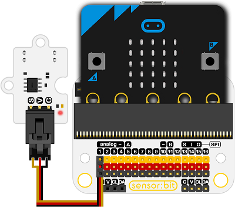
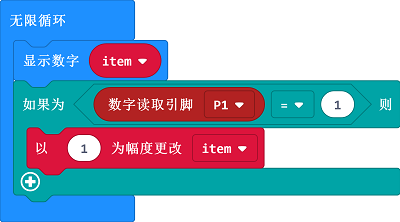

# 光电开关电子积木

## 简介
---
- Photo Interrupter Sensor是一款基于ITR9608光电开关的传感器模块，可以配合micoro:bit使用。

 

## 特性
---
- 三线端口防止错误插拔，易于使用。
- 5V电压驱动

## 技术规格
---

项目 | 参数 
:-: | :-: 
SKU|EF04012
ITR9608光电开关|内置红外发射管和接收管。
带信号LED|信号指示灯。
工作电压|DC 5.0V
接口类型|数字
引脚定义|1-Signal 2-VCC 3-GND
快速响应|高灵敏度
稳定耐用|简单的驱动电路

## 外形与定位尺寸
---
 

## 快速上手
---
### 所需器材及连接示意图
- 如图连接扩展板的P1口。

***以sensor:bit为例***

 

### 如图所示编写程序
- 显示变量`item`的值。
- 每当光电开关读取到一次值，将变量`item`加一。

### 参考程序

请参考程序连接：[https://makecode.microbit.org/_VcJWCh4hw97j](https://makecode.microbit.org/_VcJWCh4hw97j)

你也可以通过以下网页直接下载程序，下载完成后即可开始运行程序。

<iframe style="position:absolute;top:0;left:0;width:100%;height:100%;" src="https://makecode.microbit.org/#pub:_VcJWCh4hw97j" frameborder="0" sandbox="allow-popups allow-forms allow-scripts allow-same-origin"></iframe>
  
---

### 结果
- 初始micro:bit点阵屏初始显示0，当有物体在光电开关上被放置一次，计数值就增加一次。

## 相关案例
---

## 技术文档
---
