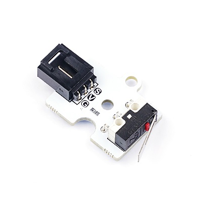
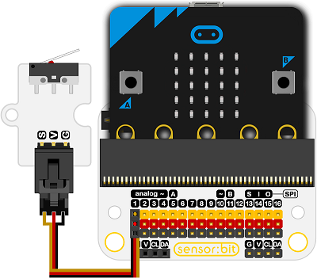
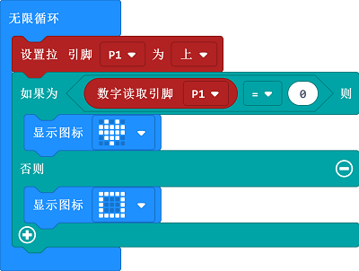
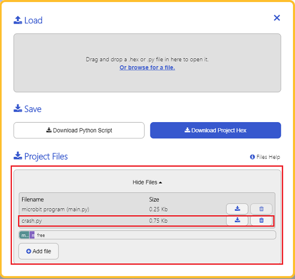

# 碰撞开关电子积木

## 简介
---
- 碰撞传感器器是一种基于碰撞元件的传感器模块，电路设计简单，灵敏度高。 
     
 

## 特性
---
- 三线端口防止错误插拔，易于使用。
- 3V电压支持micro:bit驱动

## 技术规格
---

项目 | 参数 
:-: | :-: 
SKU|EF04013
工作电压|3.3-5V
接口类型|数字
引脚定义|1-Signal 2-VCC 3-GND
响应|快速响应和高灵敏度
功耗|超低功耗
工作温度|-20-70℃
电路|简单的驱动电路
稳定性|稳定耐用

## 外形与定位尺寸
--- 

 

## 快速上手
---
### 所需器材及连接示意图
- 如图连接扩展板的P1口。

***以sensor:bit为例***

 

### 如图所示编写程序
- 拉高P1口以初始化模块。
- 当模块被按下时，返回值为0，数字读取P1口，当P1口为0时，显示一颗心。
- 否则，显示一个方框。

 

### 参考程序
请参考程序连接：[https://makecode.microbit.org/_WMwRtRXFe2tw](https://makecode.microbit.org/_WMwRtRXFe2tw)

你也可以通过以下网页直接下载程序，下载完成后即可开始运行程序。

<div style="position:relative;height:0;padding-bottom:70%;overflow:hidden;"><iframe style="position:absolute;top:0;left:0;width:100%;height:100%;" src="https://makecode.microbit.org/#pub:_WMwRtRXFe2tw" frameborder="0" sandbox="allow-popups allow-forms allow-scripts allow-same-origin"></iframe></div>  
---

### 结果
---
当传感器弹片被按下，micro:bit点阵屏上显示一个矩形，当传感器弹片被释放，显示一颗红心。

## python编程
---


### 步骤 1
下载压缩包并解压[Octopus_MicroPython-master](https://github.com/lionyhw/Octopus_MicroPython/archive/master.zip)
打开[Python editor](https://python.microbit.org/v/2.0)


为了给碰撞传感器编程，我们需要添加crash.py。点击Load/Save，然后点击Show Files（1）下拉菜单，再点击Add file在本地找到下载并解压完成的Octopus_MicroPython-master文件夹，从中选择crash.py添加进来。




### 步骤 2
### 参考程序
```
from microbit import *
from crash import *

button = CRASH(pin1)
while True:
    if button.crash_is_pressed():
        display.show(Image.HAPPY)
    else:
        display.show(Image.SAD)
```


### 结果
- 当碰撞传感器被按下时显示笑脸，否则显示哭脸。

## 相关案例
---

## 技术文档
---
[Datasheet](https://elecfreaks.com/estore/download/EF03155-Datasheet)
