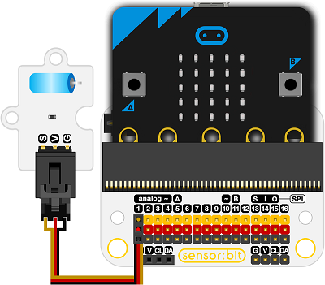

# 震动开关电子积木

## 简介
---
- 振动传感器模块是一个基于振动触发开关的模块。

 

## 特性
---
- 当处于静止状态时，指示灯LED熄灭。当受到外部振动触摸时，达到适当的振动力，或远离相应的速度（部分）努力，导电引脚会产生瞬间接通（ON）状态。此时，电气特性发生了变化。如果外力消失，电气特性将恢复OFF状态。

## 技术规格
---

项目 | 参数 
:-: | :-: 
SKU|EF04014
工作电压|3V-5V
连接模式|G-GND，V-VCC，S用于检测信号引脚
引脚定义|V-VCC G-GND S-D3
电路|简单的驱动电路
功能|能够实现非常有趣和互动的工作

## 外形与定位尺寸
---
 

## 快速上手
---
### 所需器材及连接示意图
- 如图连接扩展板的P1口。

***以sensor:bit为例***

 

### 如图所示编写程序
- 显示P1口的返回值。

 

### 参考程序
请参考程序连接：
[https://makecode.microbit.org/_32DD3C4Lv33u](https://makecode.microbit.org/_32DD3C4Lv33u)
你也可以通过以下网页直接下载程序，下载完成后即可开始运行程序。

<iframe style="position:absolute;top:0;left:0;width:100%;height:100%;" src="https://makecode.microbit.org/#pub:_32DD3C4Lv33u" frameborder="0" sandbox="allow-popups allow-forms allow-scripts allow-same-origin"></iframe>
  

### 结果
- 当振动时，micro:bit的点阵屏上显示1，否则显示0。

## 相关案例
---

## 技术文档
---
