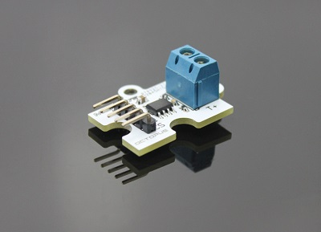

# 热电偶转换电子积木

## 简介
---
MAX6675是一款12位分辨率串行K型热电偶转换器，由美国MAXIM公司生产，具有冷端补偿，线性校正，热电偶断路检测等优点。基于芯片原理，我们的模块可用 测量温度，使用三线SPI通信，加上连接到Arduino主板的K型热电偶探头。测量结果可以在Arduino IDE中显示。（我们使用IIC / SPI_LCD模块显示测量结果）模块可以是 用于室温测量，也用于冰箱，动力室，纺织机械，空调等小空间工业设备的温度测量。

 

## 特性
---
- 具备octopus系列即插即用的特性。

## 技术规格
---
项目 | 参数 
:-: | :-: 
SKU|EF04018
电源需求|5V
响应|快速响应
灵敏度|高灵敏度
寿命|稳定耐用
电路|简单的驱动电路

## 外形与定位尺寸
---

 

## 快速上手
---
### 所需器材及连接示意图

### 添加Package

### 如图所示编写程序

 

### 参考程序
请参考程序连接：
[https://makecode.microbit.org/_CsdHE6Tu12eE](https://makecode.microbit.org/_CsdHE6Tu12eE)
你也可以通过以下网页直接下载程序，下载完成后即可开始运行程序。

<iframe style="position:absolute;top:0;left:0;width:100%;height:100%;" src="https://makecode.microbit.org/#pub:_CsdHE6Tu12eE" frameborder="0" sandbox="allow-popups allow-forms allow-scripts allow-same-origin"></iframe>
  
---

### 结果
- 在micro：bit显示器上显示出环境的温度信息。

## 相关案例
---

## 技术文档
---
