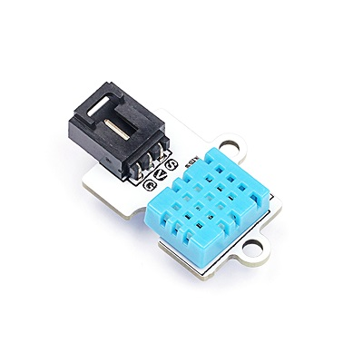
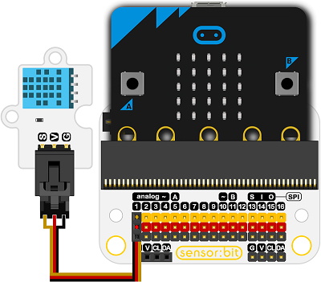

# DHT11温湿度电子积木

## 简介
---
- 温湿度传感器是基于DHT11数字温湿度传感元件的模块，对环境温度和湿度变化敏感，可用于温度报警，湿度测试等工作。 
   
 

## 特性
---
- 三线端口防止错误插拔，易于使用。

## 技术规格
---

项目 | 参数 
:-: | :-: 
SKU|EF04019
电源需求|3v-5.5v
接口类型|模拟
引脚定义|1-Signal 2-VCC 3-GND
响应|快速响应
灵敏度|高灵敏度
电路|简单的驱动电路
寿命|稳定耐用

## 外形与定位尺寸
---

 

## 快速上手
---

### 所需器材及连接示意图
- 如图连接扩展板的P1口。

***以sensor:bit为例***

 

### 添加Package
- 在MakeCode的代码抽屉中点击Advanced，查看更多代码选项。

 

- 点击“Extensions”，在弹出的对话框中搜索“iot"，下载iot-environment-kit代码库。

 

### 如图所示编写程序
- 显示当前温度值。

### 参考程序
请参考程序连接：[https://makecode.microbit.org/_dfwD11hE4Py5](https://makecode.microbit.org/_dfwD11hE4Py5)

你也可以通过以下网页直接下载程序，下载完成后即可开始运行程序。

<iframe style="position:absolute;top:0;left:0;width:100%;height:100%;" src="https://makecode.microbit.org/#pub:_dfwD11hE4Py5" frameborder="0" sandbox="allow-popups allow-forms allow-scripts allow-same-origin"></iframe>
  
---

### 结果
- 温度值在micro:bit点阵屏上滚动显示。

## 相关案例
--

## 技术文档
--
