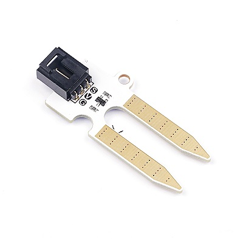
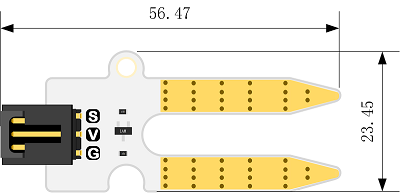
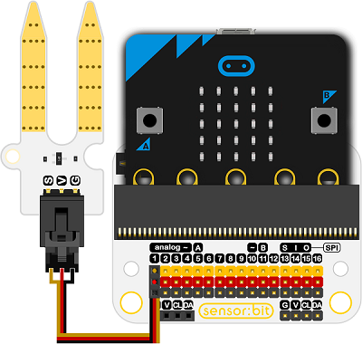

# 土壤湿度电子积木

## 简介
---
- Octopus Soil Moisture 传感器可以读取土壤中的水分含量。

 

## 特性
---

- 三线端口防止错误插拔，易于使用。
- 3V电压支持micro:bit驱动

## 技术规格
---

项目 | 参数 
:-: | :-: 
SKU|EF04027
电源需求|3V-5.5V
接口类型|模拟
引脚定义|1-Signal 2-VCC 3-GND
响应|快速响应和高灵敏度
电路|简单的驱动电路
稳定性|稳定耐用

## 外形与定位尺寸
---

 

## 快速上手
---

### 所需器材及连接示意图
- 如图连接扩展板的P1口。

***以sensor:bit为例***

 

### 添加Package
- 在MakeCode的代码抽屉中点击Advanced，查看更多代码选项。

 

- 点击“Extensions”，在弹出的对话框中搜索“iot"，下载iot代码库。


 

### 如图所示编写程序
- 循环显示土壤湿度值。

 


### 参考程序
请参考程序连接：[https://makecode.microbit.org/_8EuFUqJA3Vff](https://makecode.microbit.org/_8EuFUqJA3Vff)
你也可以通过以下网页直接下载程序，下载完成后即可开始运行程序。

<div style="position:relative;height:0;padding-bottom:70%;overflow:hidden;"><iframe style="position:absolute;top:0;left:0;width:100%;height:100%;" src="https://makecode.microbit.org/#pub:_8EuFUqJA3Vff" frameborder="0" sandbox="allow-popups allow-forms allow-scripts allow-same-origin"></iframe></div>  
---

### 结果
- 将此传感器模块插入土壤中后，可以在micro:bit的点阵屏上显示出土壤含水量的值。


## Python 编程

### 步骤 1
下载压缩包并解压[Octopus_MicroPython-master](https://github.com/lionyhw/Octopus_MicroPython/archive/master.zip)
打开[Python editor](https://python.microbit.org/v/2.0)


为了给土壤湿度传感器编程，我们需要添加soilhumidity.py。点击Load/Save，然后点击Show Files（1）下拉菜单，再点击Add file在本地找到下载并解压完成的Octopus_MicroPython-master文件夹，从中选择soilhumidity.py添加进来。


### 步骤 2
### 参考程序
```
from microbit import *
from soilhumidity import *

s = SOILHUMIDITY(pin1)
while True:
    display.scroll(s.get_soilhumidity())
    sleep(100)
```


### 结果
- 通过micro:bit的LED矩阵显示当前土壤湿度传感器的返回值。


## 相关案例
---

## 技术文档
---
