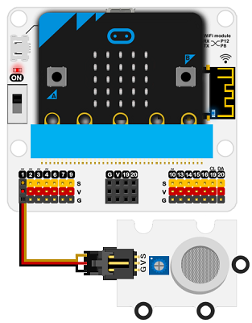

# MQ2气体传感器电子积木

## 简介
MQ2模拟气体传感器用于消费和工业市场的气体泄漏检测设备中，适用于检测LPG，异丁烷，丙烷，甲烷，酒精，氢，烟气，具有高灵敏度和快速响应时间灵敏度可通过电位器调节。 


## 特性
---
- 三线端口设计，防止误插，易于使用。
## 技术规格
---

项目 | 参数 
:-: | :-: 
SKU|EF04028
接口类型|模拟
引脚定义|S-Sigal V-VCC G-GND
工作电压|5V
产品尺寸|38x27mm


尺寸：

## 外形与定位尺寸
---


## 快速上手
---

### 所需器材及连接示意图
---

- 如下图所示，将MQ2气体传感器连接到扩展板的P1端口。

***以iot：bit为例***





### 如图所示编写程序


### 参考程序
请参考程序连接：[https://makecode.microbit.org/_KJVXj9Co2UXU](https://makecode.microbit.org/_KJVXj9Co2UXU)

你也可以通过以下网页直接下载程序，下载完成后即可开始运行程序。

<div style="position:relative;height:0;padding-bottom:70%;overflow:hidden;"><iframe style="position:absolute;top:0;left:0;width:100%;height:100%;" src="https://makecode.microbit.org/#pub:_KJVXj9Co2UXU" frameborder="0" sandbox="allow-popups allow-forms allow-scripts allow-same-origin"></iframe></div>  
---

### 结果
- 硬件连接后需要预热十分钟，等读数相对稳定后再将传感器探头靠近烟雾范围进行检测。
- 随着环境烟雾的改变，micro:bit的led显示器上显示的数值随烟雾浓度升高而变大。

## python编程
---


### 步骤 1
下载压缩包并解压[Octopus_MicroPython-master](https://github.com/lionyhw/Octopus_MicroPython/archive/master.zip)
打开[Python editor](https://python.microbit.org/v/2.0)


为了给MQ2气体传感器编程，我们需要添加mq2.py。点击Load/Save，然后点击Show Files（1）下拉菜单，再点击Add file在本地找到下载并解压完成的Octopus_MicroPython-master文件夹，从中选择mq2.py添加进来。


### 步骤 2
### 参考程序
```

from microbit import *
from mq2 import *

co = MQ2(pin1)
while True:
    display.scroll(co.get_smoke())
```


### 结果
- micro:bit的LED矩阵显示当前MQ2气体传感器的返回值。


## 相关案例
---

## 技术文档
---
