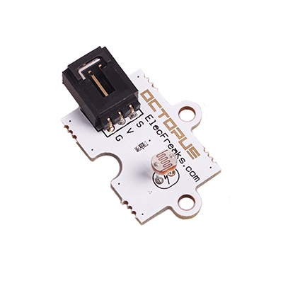
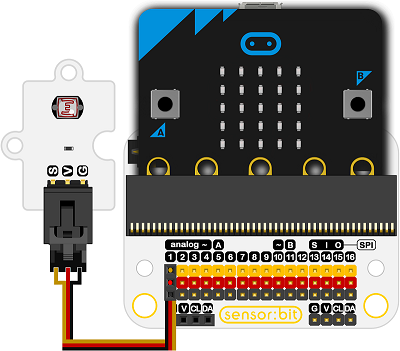
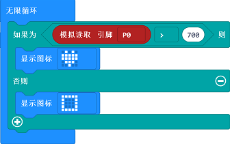

# 光敏电阻电子积木

## 简介
---
- 光电池是可以检测光线的传感器。它们体积小，价格低廉，功率低，使用方便，不会磨损。因此，它们经常出现在玩具，小工具和电器中。

 

## 特性
---
- 光电池基本上是一个电阻器，它根据光线照射到波浪形的面上的光线来改变其电阻值（欧姆Ω）。
- 它们的环保成本非常低，非常环保。
- 每个光电管传感器的作用方式都不同，即使它们来自同一批次。变化可能非常大。
- 出于这个原因，它们不应该用于尝试确定实验室中或生活中的精确光照水平。相反，您可以测得灯光变化量。 
- 三线端口防止错误插拔，易于使用。

## 技术规格
---

项目 | 参数 
:-: | :-: 
SKU|EF04032
电源需求|3V-5.5V
接口类型|模拟
引脚定义|1-Signal 2-VCC 3-GND
响应|快速响应和高灵敏度
电路|简单的驱动电路
稳定性|稳定耐用

## 外形与定位尺寸
---

 

## 快速上手
---

### 所需器材及连接示意图
- 如图连接扩展板的P1口。

***以sensor:bit为例***

 

### 如图所示编写程序
---
 

### 参考程序

请参考程序连接：[https://makecode.microbit.org/_XsgKbLhb54MP](https://makecode.microbit.org/_XsgKbLhb54MP)

你也可以通过以下网页直接下载程序，下载完成后即可开始运行程序。

<iframe style="position:absolute;top:0;left:0;width:100%;height:100%;" src="https://makecode.microbit.org/#pub:_XsgKbLhb54MP" frameborder="0" sandbox="allow-popups allow-forms allow-scripts allow-same-origin"></iframe>
  
---

### 结果
- 当光线强度大于700，显示一颗心型图案，小于700时显示一个矩形图案。
## 相关案例
---

## 技术文档
---
