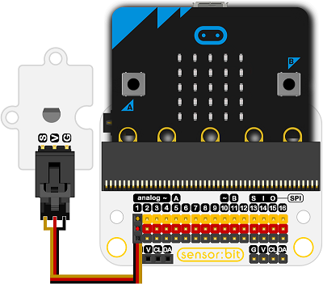

# 18B20温度传感器电子积木

## 简介
---
是基于Maxim IC DS18B20 1-Wire的数字温度传感器。 

 

## 特性
---
- 它可以报告C级，9到12位精度，-55C到125C（+/- 0.5C）。每个传感器都有一个独特的64位串行 蚀刻在其中的数字可以允许在一条数据总线上使用大量传感器。

## 技术规格
---
项目 | 参数 
:-: | :-: 
SKU|EF04042
功耗|超低功耗
工作温度|-20-70℃
工作电压|3.3-5V

## 外形与定位尺寸
---
 

## 快速上手
---

### 所需器材及连接示意图
---
***以sensor:bit为例***

 

### 添加Package
---
在MakeCode的代码抽屉中点击Advanced，查看更多代码选项。

 

点击“Extensions”，在弹出的对话框中搜索“iot"，下载iot代码库。

 
 
### 如图所示编写程序

 
 
### 参考程序

请参考程序连接：[https://makecode.microbit.org/_FEiCtaV235Xw](https://makecode.microbit.org/_FEiCtaV235Xw)

你也可以通过以下网页直接下载程序，下载完成后即可开始运行程序。

<iframe style="position:absolute;top:0;left:0;width:100%;height:100%;" src="https://makecode.microbit.org/#pub:_FEiCtaV235Xw" frameborder="0" sandbox="allow-popups allow-forms allow-scripts allow-same-origin"></iframe>
  
---

### 结果
- micro：bit的点阵屏上显示相关的温度信息。

## 相关案例
---

## 技术文档
---
[Datasheet](https://elecfreaks.com/estore/download/EF03155-Datasheet)
