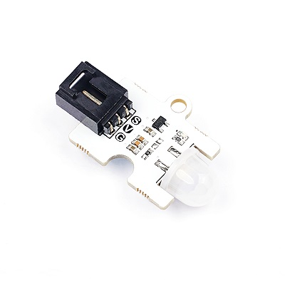
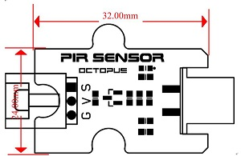
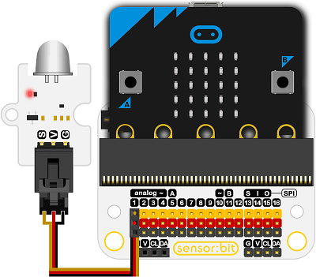
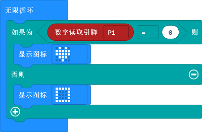

# 人体红外传感器电子积木

## 简介
---
OCTOPUS PIR传感器模块是一种基于AM412热释电数字智能传感器的电子积木。它可用于感知和检测人体或动物的运动，感应距离约4-5米。 

 

## 特性
---
- 三线端口设计，防止误插，易于使用。

## 技术规格
---

项目 | 参数 
:-: | :-: 
SKU|EF04055
电源|3.3V~5.5V
数字信号处理|SP
能耗|功率可调
输入|双向差分高阻抗传感器输入
抗干扰|内置滤波器，屏蔽其他频率的干扰
电源|出色的电源抑制，对RF干扰Schmidt REL输出不敏感
电压稳定性|低电压，低功耗，上电后瞬间稳定
工作温度|-25~85℃
尺寸|32.00mm×24.00mm


## 外形与定位尺寸
---

 

## 快速上手
---

### 所需器材及连接示意图
- 如图连接扩展板的P1口

***以sensor：bit为例***


### 添加packege

### 如图所示编写程序

1.读取P1的红外信息

2.当信息为0显示一个心

3.当信息为1显示一个矩形

 

### 参考程序

请参考程序连接：[https://makecode.microbit.org/_esoRoUPzUAhf](https://makecode.microbit.org/_esoRoUPzUAhf)

你也可以通过以下网页直接下载程序，下载完成后即可开始运行程序。

<div style="position:relative;height:0;padding-bottom:70%;overflow:hidden;"><iframe style="position:absolute;top:0;left:0;width:100%;height:100%;" src="https://makecode.microbit.org/#pub:_esoRoUPzUAhf" frameborder="0" sandbox="allow-popups allow-forms allow-scripts allow-same-origin"></iframe></div>  
---

### 结果
- 当有人体接近，micro：bit上显示矩形图案，当人体离开，micro：bit上显示心形图案。


## Python 编程

### 步骤 1
下载压缩包并解压[Octopus_MicroPython-master](https://github.com/lionyhw/Octopus_MicroPython/archive/master.zip)
打开[Python editor](https://python.microbit.org/v/2.0)


为了给人体红外传感器编程，我们需要添加pir.py。点击Load/Save，然后点击Show Files（1）下拉菜单，再点击Add file在本地找到下载并解压完成的Octopus_MicroPython-master文件夹，从中选择pir.py添加进来。


### 步骤 2
### 参考程序
```
from microbit import *
from pir import *

sensor = PIR(pin1)
while True:
    if sensor.PIR_is_decection():
        display.show(Image.HAPPY)
    else:
        display.show(Image.SAD)
```


### 结果
- 当人体红外传感器感应到有人时显示笑脸，否则显示哭脸。


## 相关案例
---

## 技术文档
---
[datasheet](https://elecfreaks.com/estore/download/EF4055-Datasheet/https://www.elecfreaks.com/wiki/index.php?title=Octopus_PIR_sensor_Brick
)
