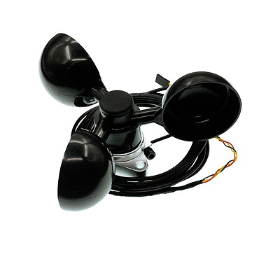

# 风速传感器电子积木

## 简介
---
这是一款防水设计的风速传感器。它使用octopus相关产品的标准连接器，当风速变大，得到更大的输出电压。

 

## 特性
---
- 三线端口设计，防止误插，易于使用。

## 技术规格
---

项目 | 参数 
:-: | :-: 
SKU|EF04083
功耗|超低功耗
工作温度|-20-70℃
工作电压|3.3-5V

## 外形与定位尺寸
---

## 快速上手
---

### 所需器材及连接示意图

- 将风速模块链接在扩展板的P1口

- 需使用电源模块供电
### 添加packege
---
在MakeCode的代码抽屉中点击Advanced，查看更多代码选项。

 

点击“Extensions”，在弹出的对话框中搜索“iot"，下载iot代码库。

 

### 如图所示编写程序
---
  

### 参考程序
---
请参考程序连接：[https://makecode.microbit.org/_D8WLUvFCm8Kq](https://makecode.microbit.org/_D8WLUvFCm8Kq)

你也可以通过以下网页直接下载程序，下载完成后即可开始运行程序。

<iframe style="position:absolute;top:0;left:0;width:100%;height:100%;" src="https://makecode.microbit.org/#pub:_D8WLUvFCm8Kq" frameborder="0" sandbox="allow-popups allow-forms allow-scripts allow-same-origin"></iframe>
  
---

### 结果
- 随着外界风速的大小，micro:bit 的点阵屏上显示出环境的风速信息。

## 相关案例
---

## 技术文档
---
