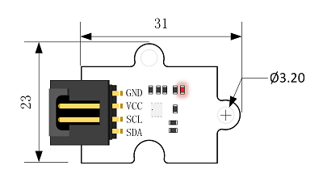
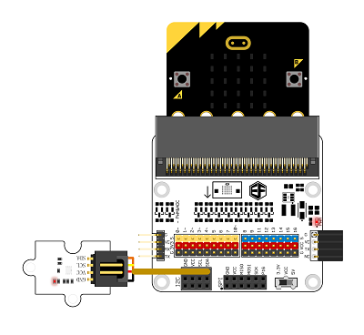

# BME280 气压电子积木

## 简介
---
Octopus BME280 Pressure Sensor 是基于数字湿度、压力和温度传感器的组合传感器，还能够根据气压值计算出海拔高度。

## 特性 
---
- 低功耗、小尺寸。
- 3mm标准定位孔。
- 额定3.3v供电，支持micro:bit。
- 支持I2C和SPI协议通讯。
  
## 参数
---

项目 | 参数 
:-: | :-: 
品名|Octopus BME280 Pressure Sensor
版本号|V1.0
SKU| EF04087
工作电压|DC 1.2V-3.6V
接口类型|IIC（从模式3.4MHz）或SPI（3线或4线制从模式10MHz）
相对湿度测量范围|0%～100% 湿度响应时间：大于1s
湿度测量误差|±2%；湿度迟滞：±1%；分辨率0.8%
气压测量范围|300～1100hPa（百帕斯卡）
气压测量误差|±1hPa 分辨率0.18Pa
温度测量范围|0℃～65℃
温度测量误差|±0.5℃ 最大±1℃；分辨率0.1℃
尺寸|31 x 23 mm

### 外型与定位尺寸  

## 快速上手  
---  
### 硬件连接  

将模块通过带扣杜邦线插入octopus:bit上的I2C接口上，将micro:bit主板插入octopus:bit中。

### 软件编程  

#### 目的
读取气压值，并显示在micro:bit上的屏幕上。

### 添加package
在MakeCode的代码抽屉中点击Advanced，查看更多代码选项。

点击“Add Package”，在弹出的对话框中搜索“iot"，下载iot-environment-bit代码库。

如图所示编写程序，读取气压值。  

#### 程序下载
程序代码链接：[https://makecode.microbit.org/_X4T7s8YerXdc](https://makecode.microbit.org/_X4T7s8YerXdc)

你也能通过下列窗口直接下载代码  

<iframe style="position:absolute;top:0;left:0;width:100%;height:100%;" src="https://makecode.microbit.org/#pub:_X4T7s8YerXdc" frameborder="0" sandbox="allow-popups allow-forms allow-scripts allow-same-origin"></iframe>

### 结果  
micro:bit点阵屏幕上滚动显示气压值，单位为MPa。

## 常见问题
