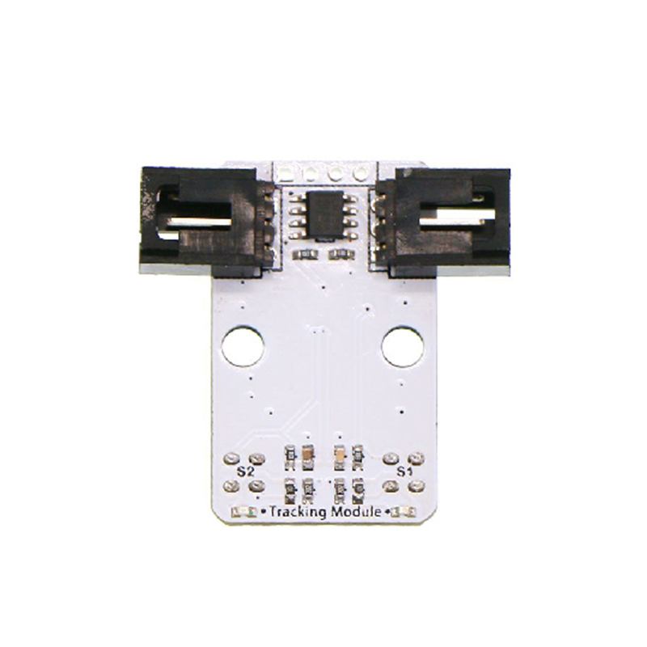
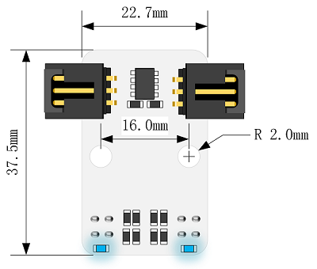

# 两路巡线模块电子积木

## 简介
---
两路巡线模块电子积木集成了两组反射式红外对管，可通过它来识别黑线。通常应用该模块来做巡线智能小车，我们可以任意设计黑线轨迹，通过编程使小车按我们设计的黑线轨迹行驶。



## 特性
---
- 利用红外光探测，抗干扰能力强。
- 定位孔尺寸兼容主流小车底盘。
- 两个3P带锁杜邦接口和一个4P焊盘，能够直接用两个GVS线连接连接两个3P杜邦接口，接线十分方便。

## 参数
---

项目 | 参数 
:-: | :-: 
品名|两路巡线电子积木
SKU|EF04088
工作电压|DC 3-5V
接口|两个标准G-V-S接口
输出信号类型|数字
黑线输出电平|低电平
白线输出电平|高电平
有效距离|2~12mm
尺寸|22.74 x 37.45mm
净重|4.8g

### 外型与定位尺寸


## 包装清单
---
- 1 x Octopus 2 Channel Tracking Module。
- 2 x 3P的GVS杜邦连接线 

## 快速上手
---
### 硬件连接
将模块安装在motor:bit小车上。
将左边的接口接入P13，右边的接口接入P14。（均以驾驶员视角为参照）

 


### Micro:bit 示例代码
程序链接：[https://makecode.microbit.org/_A5zAEjRw3Ez2](https://makecode.microbit.org/_A5zAEjRw3Ez2)
你也能通过以下页面直接下载该程序。
<div style="position:relative;height:0;padding-bottom:70%;overflow:hidden;"><iframe style="position:absolute;top:0;left:0;width:100%;height:100%;" src="https://makecode.microbit.org/#pub:_A5zAEjRw3Ez2" frameborder="0" sandbox="allow-popups allow-forms allow-scripts allow-same-origin"></iframe></div>

### 结果
将小车放在黑线轨迹上，打开开关，小车便沿着黑线轨迹行驶。


## Python 编程

### 步骤 1
下载压缩包并解压[Octopus_MicroPython-master](https://github.com/lionyhw/Octopus_MicroPython/archive/master.zip)
打开[Python editor](https://python.microbit.org/v/2.0)


为了给双路巡线模块编程，我们需要添加tracking.py。点击Load/Save，然后点击Show Files（1）下拉菜单，再点击Add file在本地找到下载并解压完成的Octopus_MicroPython-master文件夹，从中选择tracking.py添加进来。


### 步骤 2
### 参考程序
```
from microbit import *
from tracking import *

trc = TRACKING(pin1,pin2)
while True:
    if trc.get_state() == 11:
        display.show(Image.HAPPY)
    elif trc.get_state() == 00:
        display.show(Image.SAD)
```


### 结果
- 双路巡线传感器两个巡线头都检测到白色时显示哭脸，都检测到黑色时显示笑脸。


## 常见问题
---
