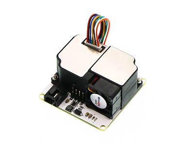
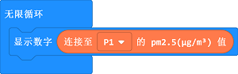

# PM2.5电子积木

## 简介
---
PM2.5电子积木是OCTOPUS系列中一个检测环境PM2.5浓度的传感器模块，它的工作原理是基于ZH03激光粉尘传感器模组，通过这个模组对空气中的粉尘颗粒物进行检测，具有良好的一致性、稳定性。模块具有PWM输出和串口输出，方便使用！

## 特性
---
- 兼容3.3V/5V设备直接驱动。
- 兼容micro:bit和Arduino驱动。
- 标准的3线GVS接口。
- 传感器一致性好、数据准确、实时响应，小分辨颗粒直径0.3μm。
- 支持PWM输出和串口输出。

## 参数
---

|项目|参数|
|:-:|:-:|
|品名|PM2.5电子积木|
|SKU|EF04090|
|版本号|V1.2|
|输入电压|DC3~5V|
|工作电流|<120mA|
|休眠电流|<10mA|
|工作温度|-10~50℃|
|可检测气体|PM2.5|
|尺寸|50.00mm X 50.00mm|
|净重|46.30g|

## 外形与安装定位尺寸
---

## 引脚接口框图
---

## 主体功能模块介绍
---
### ZH03B传感器模块

ZH03B传感器模块用于检测所处环境的PM2.5浓度。

### 3PIN标准GVS电子积木接口

标准GVS电子积木接口，其中S是3.3V PWM信号输出引脚。

### 4PIN串口输出接口

3.3V串口信号输出接口。

## 快速上手

### 硬件连接
将PM2.5电子积木通过iot:bit的P1口

### 软件编程
#### 步骤1 打开makecode
打开[makecode](https://makecode.microbit.org/ "makecode")在线编程网页。

#### 步骤2 
搜索关键词`iot`，添加`iot-environment-kit`软件包。

#### 步骤3 编写程序

#### 步骤4 下载
完整的程序代码如下：[https://makecode.microbit.org/_A1qAkv6w9Wev](https://makecode.microbit.org/_A1qAkv6w9Wev)

你也能通过以下网页直接下载程序：  

<iframe style="position:absolute;top:0;left:0;width:100%;height:100%;" src="https://makecode.microbit.org/#pub:_A1qAkv6w9Wev" frameborder="0" sandbox="allow-popups allow-forms allow-scripts allow-same-origin"></iframe>

#### 结果
5x5屏幕滚动显示PM2.5的数值，单位为μg/m3。

## 常见问题
