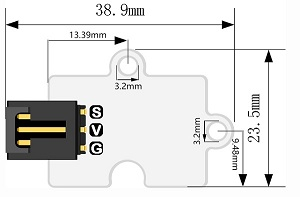

# 模拟透明光敏电子积木

## 简介
---
- 模拟透明光敏是可以检测光线的传感器。它们体积小，价格低廉，功率低，使用方便，不会磨损。

## 特性
---

## 技术规格
---

项目 | 参数 
:-: | :-: 
SKU|EF04092
电源需求|3V-5.5V
接口类型|模拟
引脚定义|1-Signal 2-VCC 3-GND
响应|快速响应和高灵敏度
电路|简单的驱动电路
稳定性|稳定耐用

## 外形与定位尺寸
---

 

## 快速上手
---

### 所需器材及连接示意图
- 如图连接扩展板的P1口。

### 如图所示编写程序
---
在MakeCode的代码抽屉中点击高级，查看更多代码选项。

为了给智慧家居套件编程，我们需要添加一个代码库。在代码抽屉底部找到“扩展”，并点击它。这时会弹出一个对话框。搜索“smarthome"，然后点击下载这个代码库。

注意：如果你得到一个提示说一些代码库因为不兼容的原因将被删除，你可以根据提示继续操作，或者在项目菜单栏里面新建一个项目。

### 参考程序

请参考程序连接：[https://makecode.microbit.org/_iMH0jK6quc2j](https://makecode.microbit.org/_iMH0jK6quc2j)

你也可以通过以下网页直接下载程序，下载完成后即可开始运行程序。

<iframe style="position:absolute;top:0;left:0;width:100%;height:100%;" src="https://makecode.microbit.org/#pub:_iMH0jK6q" frameborder="0" sandbox="allow-popups allow-forms allow-scripts allow-same-origin"></iframe>
  
---

### 结果
- 当光线强度小于50，显示指定图标，否则显示一个笑脸图案。
## 相关案例
---

## 技术文档
---
