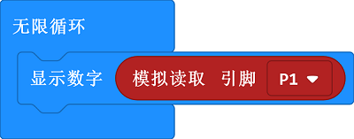
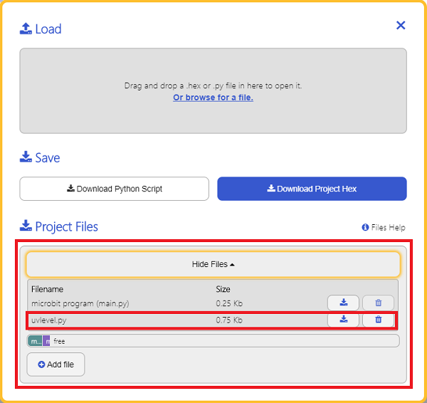

# 紫外线强度传感器电子积木

## 简介
---

Octopus Analog UV sensor (GUVA-S12SD)是我们OCTOPUS系列的紫外线传感器电子积木，它的基本设计是根据OCTOPUS电子积木系列设定的，它的外形、PCB固定孔、电子积木的接口的设定是相同的。

可以测量太阳光紫外线强度总量，线性电压信号输出，可用作紫外线测试仪，紫外线指数仪，火焰检测等。


## 特性 
---
- 为需要高可靠性和精准性测量紫外线指数（UVI）的场合所设计
- 采用3V供电，可支持micro:bit。
- 接线方便。

## 参数
---
- 品名：紫外线强度传感器电子积木
- SKU：EF04093
- 工作电压：DC 3~5.5V
- 连接模式：G-GND，V-VCC，S-信号引脚
- 测试精度：±1 UV INDEX
- 响应波长：200nm-370nm
- 响应时间：小于0.5秒
- 尺寸：38.9x23.5mm
- 净重：5g

## 外型与定位尺寸  
---


## 快速上手  
---  
### 硬件连接  

将模块通过带扣杜邦线插入octopus:bit上的P1引脚，将micro:bit主板插入octopus:bit。


### 软件编程  

打开makecode，模拟读取P1口，返回值为紫外线强度，显示在LED点阵显示屏上。



程序代码链接：[https://makecode.microbit.org/_4urWJCMeuh4L](https://makecode.microbit.org/_4urWJCMeuh4L)

你也能通过下列窗口直接下载代码
<div style="position:relative;height:0;padding-bottom:70%;overflow:hidden;"><iframe style="position:absolute;top:0;left:0;width:100%;height:100%;" src="https://makecode.microbit.org/#pub:_4urWJCMeuh4L" frameborder="0" sandbox="allow-popups allow-forms allow-scripts allow-same-origin"></iframe></div>

### 结果  

点阵显示屏显示当前紫外线值。


## Python 编程

### 步骤 1
下载压缩包并解压[Octopus_MicroPython-master](https://github.com/lionyhw/Octopus_MicroPython/archive/master.zip)
打开[Python editor](https://python.microbit.org/v/2.0)


为了给紫外线传感器编程，我们需要添加uvlevel.py。点击Load/Save，然后点击Show Files（1）下拉菜单，再点击Add file在本地找到下载并解压完成的Octopus_MicroPython-master文件夹，从中选择uvlevel.py添加进来。




### 步骤 2
### 参考程序
```
from microbit import *
from uvlevel import *

s = UVLEVEL(pin1)
while True:
    display.scroll(s.get_uvlevel())
```


### 结果
- 通过LED矩阵显示紫外线传感器的返回值。


## 常见问题
