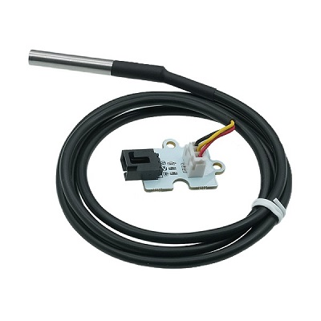
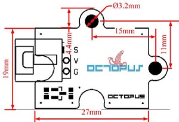
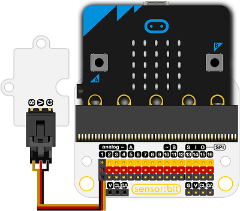

# 防水温度检测电子积木

## 简介
---
- 该温度传感器是一种基于18b20的温度探测仪，用于测量液体温度。

 

## 特性
---

- 三线端口防止错误插拔，易于使用。
- 3V电压支持micro:bit驱动。
- 防水处理，可以浸入液体使用。

## 技术规格
---

- SKU：EF04095
- 工作电压：DC 3.0V
- 电源需求：3v-5v
- 接口类型：模拟
- 防水探头长度：1米
- 引脚定义：1-Signal 2-VCC 3-GND
- 响应：快速响应和高灵敏度
- 电路：简单的驱动电路
- 稳定性：稳定耐用

## 外形与定位尺寸
---

 

## 快速上手
---
### 连接示意

- 连接扩展板的P1口。

 

### 添加packege
---
在MakeCode的代码抽屉中点击Advanced，查看更多代码选项。

 

点击“Extensions”，在弹出的对话框中搜索“`https://github.com/elecfreaks/pxt-ds18b20`"，下载18b20代码库。

### 如图所示编写程序
---
  

### 参考程序
---
请参考程序连接：[https://makecode.microbit.org/_1x1ERwiT1bui](https://makecode.microbit.org/_1x1ERwiT1bui)

你也可以通过以下网页直接下载程序，下载完成后即可开始运行程序。

<iframe style="position:absolute;top:0;left:0;width:100%;height:100%;" src="https://makecode.microbit.org/#pub:_1x1ERwiT1bui" frameborder="0" sandbox="allow-popups allow-forms allow-scripts allow-same-origin"></iframe>
  
---

### 结果

- micro:bit 的点阵屏上显示当前温度。

## 相关案例
---

## 技术文档
---
