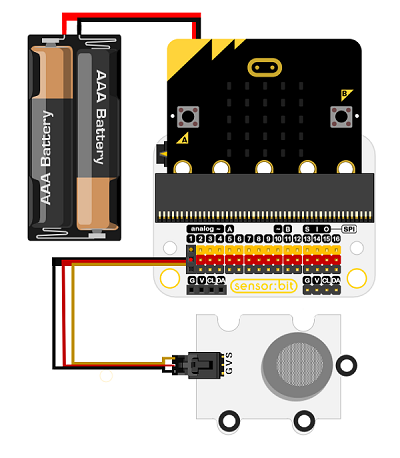

# MG811二氧化碳传感器电子积木

## 简介
---

Octopus MG811 CO2 Gas Sensor是我们OCTOPUS系列的二氧化碳传感器电子积木，它的基本设计是根据OCTOPUS电子积木系列设定的，它的外形、PCB固定孔、电子积木的接口的设定是相同的。
这款CO2传感器CO2浓度越高，输出的电压值就越小。通过我们的说明书和样例代码，用户可以轻松的读取CO2数值。
该模块采用工业级的MG-811 CO2探头，对CO2极为敏感，同时还能排除酒精和CO的干扰。该探头对环境温湿度的依赖小，性能稳定，快速恢复响应。模块自带信号放大电路，进一步提高灵敏度。另外，板子上的加热电路直接把5V转换成稳定6V，为探头加热供电，提高模块适应性。

**注意：**

- 此款为电化学二氧化碳传感器，模块工作时，探头会自动加热，请勿用手触碰，以免烫伤！
- 存储时请密封保存，以免探头因长期暴露在空气中，导致探头“中毒”，此时需要连续加热48小时来恢复活性！
- 本产品采用MG-811探头属于电化学传感器，为得到更精确的测量值，请先对传感器进行标定操作。


## 特性 
---
- 传感器探头工作电压：6v
- 内置升压电路，支持3.7~5v DC电源输入,电源电流大于500mA
- OCTOPUS电子积木系列
- 接线方便

## 参数
---
- 品名：MG811二氧化碳传感器电子积木
- SKU：EF04100
- 工作电压：DC 3.7~5v
- 连接模式：G-GND，V-VCC，S-信号引脚
- 尺寸：31 * 48mm
- 净重：9.6g

## 外型与定位尺寸  
---


## 快速上手  
---  
## 快速上手
---

### 所需器材及连接示意图
---

- 如下图所示，将二氧化碳气体传感器连接到扩展板的P1端口。

***以iot：bit为例***





### 如图所示编写程序


### 参考程序
请参考程序连接：[https://makecode.microbit.org/_KJVXj9Co2UXU](https://makecode.microbit.org/_KJVXj9Co2UXU)

你也可以通过以下网页直接下载程序，下载完成后即可开始运行程序。

<div style="position:relative;height:0;padding-bottom:70%;overflow:hidden;"><iframe style="position:absolute;top:0;left:0;width:100%;height:100%;" src="https://makecode.microbit.org/#pub:_KJVXj9Co2UXU" frameborder="0" sandbox="allow-popups allow-forms allow-scripts allow-same-origin"></iframe></div>  
---

### 结果
- 硬件连接后需要预热三分钟，等读数相对稳定后再将传感器探头靠近被测气体进行检测。
- 随着环境二氧化碳气体浓度的改变，micro:bit的led显示器上显示的数值随之变化。

## python编程
---


### 步骤 1
下载压缩包并解压[Octopus_MicroPython-master](https://github.com/lionyhw/Octopus_MicroPython/archive/master.zip)
打开[Python editor](https://python.microbit.org/v/2.0)


为了给二氧化碳气体传感器编程，我们需要添加co2.py。点击Load/Save，然后点击Show Files（1）下拉菜单，再点击Add file在本地找到下载并解压完成的Octopus_MicroPython-master文件夹，从中选择co2.py添加进来。


### 步骤 2
### 参考程序
```
from microbit import *
from co2 import *

co2 = CO2(pin1)
while True:
    print(co2.get_co2())
```


### 结果
- 在micro:bit的LED矩阵上显示当前二氧化碳传感器返回的读数。

### 硬件连接  

将模块通过带扣杜邦线插入Arduino UNO上的A0引脚，Arduino主控板必须外接供电（7.5V-9V）。


### 软件编程  

#### 标定操作

本模块采用的MG-811探头属于电化学传感器，为得到更精确的测量值，请先对传感器进行标定操作。
给本模块提供稳定的电源，探头工作后会进行加热。请将本模块放在空气清新的地方，连续加热48小时。然后测量本模块的输出电压，将输出电压值(单位：V)除以8.5，得到的数值填入代码中的宏定义：
```
#define ZERO_POINT_VOLTAGE (此处改成：电压值(V)/8.5) 
```

例如，用万用表测量CO2模块输出的电压为2.4V，那么2.4/8.5=0.282, 则修改如下：

```
#define ZERO_POINT_VOLTAGE (0.282) 
```

代码修改完，重新上传至Arduino主控板。至此，标定完成了。之后可用于实际的测量。

#### 示例代码
```
/*******************Demo for MG-811 Gas Sensor Module V1.1*****************************
************************************************************************************/

/************************Hardware Related Macros************************************/
#define         MG_PIN                       (A0)     //define which analog input channel you are going to use
#define         DC_GAIN                      (8.5)   //define the DC gain of amplifier

/***********************Software Related Macros************************************/
#define         READ_SAMPLE_INTERVAL         (50)    //define how many samples you are going to take in normal operation
#define         READ_SAMPLE_TIMES            (5)     //define the time interval(in milisecond) between each samples in 
                                                     //normal operation

/**********************Application Related Macros**********************************/
//These two values differ from sensor to sensor. user should derermine this value.
#define         ZERO_POINT_VOLTAGE           (0.220) //define the output of the sensor in volts when the concentration of CO2 is 400PPM
#define         REACTION_VOLTGAE             (0.030) //define the voltage drop of the sensor when move the sensor from air into 1000ppm CO2

/*****************************Globals***********************************************/
float           CO2Curve[3]  =  {2.602,ZERO_POINT_VOLTAGE,(REACTION_VOLTGAE/(2.602-3))};   
                                     //two points are taken from the curve. 
                                     //with these two points, a line is formed which is
                                     //"approximately equivalent" to the original curve.
                                     //data format:{ x, y, slope}; point1: (lg400, 0.324), point2: (lg4000, 0.280) 
                                     //slope = ( reaction voltage ) / (log400 –log1000) 

void setup()
{
   Serial.begin(9600);              //UART setup, baudrate = 9600bps
   Serial.print("MG-811 Demostration\n");                
}

void loop()
{
    int percentage;
    float volts;

    volts = MGRead(MG_PIN);
    Serial.print( "SEN0159:" );
    Serial.print(volts); 
    Serial.print( "V           " );

    percentage = MGGetPercentage(volts,CO2Curve);
    Serial.print("CO2:");
    if (percentage == -1) {
        Serial.print( "<400" );
    } else {
        Serial.print(percentage);
    }

    Serial.print( "ppm" );  
    Serial.print("\n");

    delay(500);
}

/*****************************  MGRead *********************************************
Input:   mg_pin - analog channel
Output:  output of SEN-000007
Remarks: This function reads the output of SEN-000007
************************************************************************************/ 
float MGRead(int mg_pin)
{
    int i;
    float v=0;

    for (i=0;i<READ_SAMPLE_TIMES;i++) {
        v += analogRead(mg_pin);
        delay(READ_SAMPLE_INTERVAL);
    }
    v = (v/READ_SAMPLE_TIMES) *5/1024 ;
    return v;  
}

/*****************************  MQGetPercentage **********************************
Input:   volts   - SEN-000007 output measured in volts
         pcurve  - pointer to the curve of the target gas
Output:  ppm of the target gas
Remarks: By using the slope and a point of the line. The x(logarithmic value of ppm) 
         of the line could be derived if y(MG-811 output) is provided. As it is a 
         logarithmic coordinate, power of 10 is used to convert the result to non-logarithmic 
         value.
************************************************************************************/ 
int  MGGetPercentage(float volts, float *pcurve)
{
   if ((volts/DC_GAIN )>=ZERO_POINT_VOLTAGE) {
      return -1;
   } else { 
      return pow(10, ((volts/DC_GAIN)-pcurve[1])/pcurve[2]+pcurve[0]);
   }
}
```


### 结果

打开串口监视器，大约五分钟后，你会得到你周围二氧化碳浓度的数据。

## 常见问题
