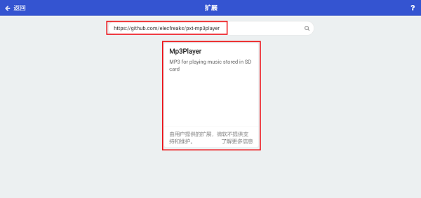
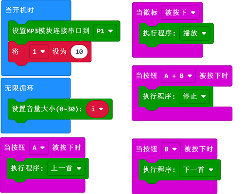

# MP3模块

## 简介
用于播放音乐。

## 技术规格
---

项目 | 参数 
:-: | :-: 
SKU|EF04104
接口|3P电子线
接口类型|数字输入
工作电压|3.3V
核心IC|YX6300

## 外形与定位尺寸
---

## 快速上手
---

### 所需器材及连接示意图
---

- 如下图所示，将将MP3模块连接到sensor:bit的P1端口。

## makecode编程
---

### 步骤 1
在MakeCode的代码抽屉中点击“高级”，查看更多代码选项。

为了给MP3模块编程，我们需要添加一个扩展库。在代码抽屉底部找到“扩展”，并点击它。这时会弹出一个对话框，搜索”https://github.com/elecfreaks/pxt-mp3player “，然后点击下载这个代码库。

*注意：*如果你得到一个提示说一些代码库因为不兼容的原因将被删除，你可以根据提示继续操作，或者在项目菜单栏里面新建一个项目。
### 步骤 2
### 如图所示编写程序

### 参考程序
请参考程序连接：[https://makecode.microbit.org/_9MhgxtXgK5x7](https://makecode.microbit.org/_9MhgxtXgK5x7)

你也可以通过以下网页直接下载程序，下载完成后即可开始运行程序。

<iframe style="position:absolute;top:0;left:0;width:100%;height:100%;" src="https://makecode.microbit.org/#pub:_9MhgxtXgK5x7" frameborder="0" sandbox="allow-popups allow-forms allow-scripts allow-same-origin"></iframe>
  
---

### 结果
- 通过micro:bit控制MP3模块播放音乐。

### 注意

物理拷贝顺序，第一个拷贝进去的就是1，可以不修改文件名，无法单独指定文件名；

文件夹名必须是两位数字，01 ~ 99，例如：01；

文件名前必须加3位数字001 ~ 999，例如：002~天堂.MP3。

