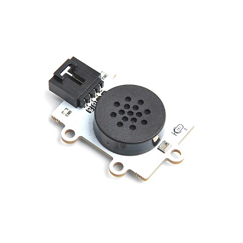
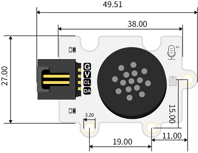
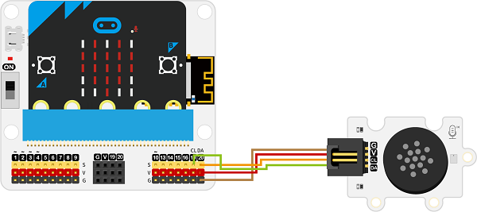
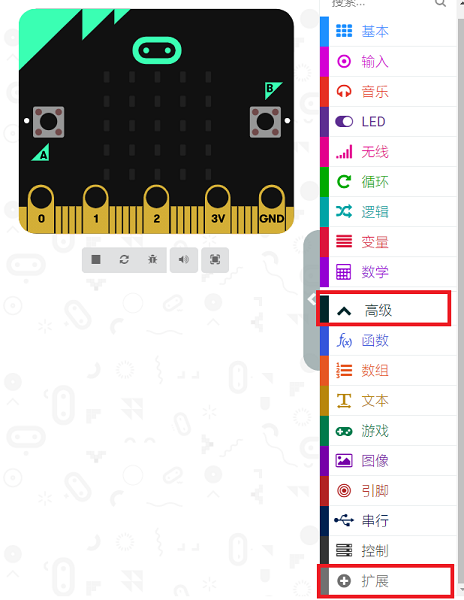
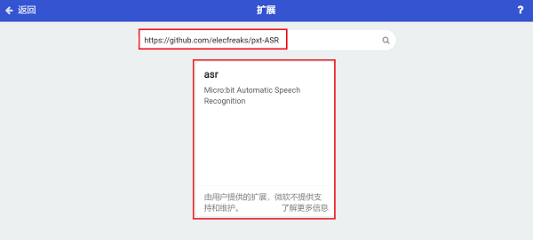
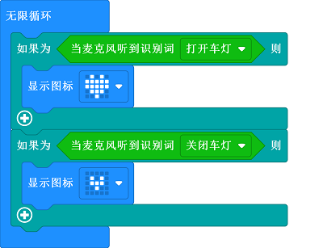

# 语音识别电子积木

## 简介
实现语音智能控制，如语音控制智能车前进、后退、启动巡线模式等。

 

## 技术规格
---

项目 | 参数 
:-: | :-: 
SKU|EF04108
接口类型|IIC
工作电压|3.3V
核心IC|SNR3512M

## 外形与定位尺寸
---

 

## 快速上手
---

### 所需器材及连接示意图
---

- 如下图所示，语音识别模块连接到IIC接口。

***以IOT：bit为例***

 

### 添加软件库
在MakeCode的代码抽屉中点击高级，查看更多代码选项。

点击“扩展”，在弹出的对话框中搜索 “https://github.com/elecfreaks/pxt-ASR" ，下载语音识别电子积木的代码库。

### 如图所示编写程序

 

### 参考程序
请参考程序连接：[https://makecode.microbit.org/_fo9e2aJofc5d](https://makecode.microbit.org/_fo9e2aJofc5d)

你也可以通过以下网页直接下载程序，下载完成后即可开始运行程序。

<iframe style="position:absolute;top:0;left:0;width:100%;height:100%;" src="https://makecode.microbit.org/#pub:_fo9e2aJofc5d" frameborder="0" sandbox="allow-popups allow-forms allow-scripts allow-same-origin"></iframe>
  
---

### 结果
- 通过语音识别模块控制LED矩阵显示的内容。
## 相关案例
---

## 技术文档
---
