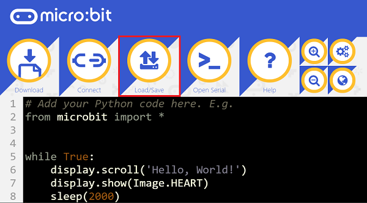

# 灰尘传感器电子积木

## 简介
带有夏普GP2Y1010AU0F的octupus通尘埃传感器检测模块采用夏普光学灰尘传感器（GP2Y1010AU0F）。 用于检测直径超过0.8μm的尘埃颗粒的密度，如香烟烟雾。

 

## 特性
---
- 三线端口设计，防止误插，易于使用。
## 技术规格
---

项目 | 参数 
:-: | :-: 
SKU|EF11083
灵敏度|0.5V /（100μg/ m3）
有效范围|500μg/ m3
工作电压|2.5V~5.5V
工作电流|20mA（最大值）
工作温度|-10℃~65℃
储存温度|-20℃~80℃
寿命|5年
产品尺寸|63.2mm×41.3mm×21.1mm
固定孔尺寸|2.0mm
通风孔尺寸|9.0mm

## 外形与定位尺寸
---

 

## 快速上手
---

### 所需器材及连接示意图
---

- 如下图所示，led连接扩展板的P1口 ,out口连接在P2口。

***以sensor：bit为例***

 

### 添加packege
在MakeCode的代码抽屉中点击Advanced，查看更多代码选项。


点击“Extensions”，在弹出的对话框中搜索“iot"，下载iot代码库。


### 如图所示编写程序


 

### 参考程序
请参考程序连接：[https://makecode.microbit.org/_HWvDbU9aV407](https://makecode.microbit.org/_HWvDbU9aV407)

你也可以通过以下网页直接下载程序，下载完成后即可开始运行程序。

<div style="position:relative;height:0;padding-bottom:70%;overflow:hidden;"><iframe style="position:absolute;top:0;left:0;width:100%;height:100%;" src="https://makecode.microbit.org/#pub:_HWvDbU9aV407" frameborder="0" sandbox="allow-popups allow-forms allow-scripts allow-same-origin"></iframe></div>  
---

### 结果
- 随着环境烟雾的改变，micro:bit的led显示器上显示相应的烟雾浓度数值。


## Python 编程

### 步骤 1
下载压缩包并解压[Octopus_MicroPython-master](https://github.com/lionyhw/Octopus_MicroPython/archive/master.zip)
打开[Python editor](https://python.microbit.org/v/2.0)



为了给灰尘传感器编程，我们需要添加dust.py。点击Load/Save，然后点击Show Files（1）下拉菜单，再点击Add file在本地找到下载并解压完成的Octopus_MicroPython-master文件夹，从中选择dust.py添加进来。


### 步骤 2
### 参考程序
```
from microbit import *
from dust import *

dis = DUST(pin1,pin2)
while 1:
    display.scroll(dis.get_dust())
    sleep(500)
```


### 结果
- 通过LED矩阵显示灰尘传感器的返回值。


## 相关案例
---

## 技术文档
---
