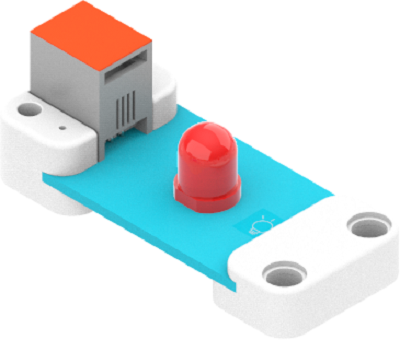
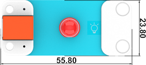

# LED-红

## 简介
红色LED灯，通常用作指示灯。



## 特性
---
- RJ11端口设计，防止误插，易于使用。
## 技术规格
---

项目 | 参数 
:-: | :-: 
SKU|EF05009
接口|RJ11
接口类型|模拟输入
工作电压|3.3V
产品尺寸|55.8 x 23.8 mm


## 外形与定位尺寸
---





## 快速上手
---

### 所需器材及连接示意图
---

- 如下图所示，将红色LED灯连接到哪吒扩展板的J1端口，并将电位器连接到哪吒扩展板的J2端口。


## makecode编程
---

### 步骤 1
在MakeCode的代码抽屉中点击“高级”，查看更多代码选项。


为了给红色LED编程，我们需要添加一个扩展库。在代码抽屉底部找到“扩展”，并点击它。这时会弹出一个对话框，搜索”PlanetX“，然后点击下载这个代码库。


*注意：*如果你得到一个提示说一些代码库因为不兼容的原因将被删除，你可以根据提示继续操作，或者在项目菜单栏里面新建一个项目。
### 步骤 2
### 如图所示编写程序


### 参考程序
请参考程序连接：[https://makecode.microbit.org/_eTHcUiPhjLpz](https://makecode.microbit.org/_eTHcUiPhjLpz)

你也可以通过以下网页直接下载程序，下载完成后即可开始运行程序。

<div style="position:relative;height:0;padding-bottom:70%;overflow:hidden;"><iframe style="position:absolute;top:0;left:0;width:100%;height:100%;" src="https://makecode.microbit.org/#pub:_eTHcUiPhjLpz" frameborder="0" sandbox="allow-popups allow-forms allow-scripts allow-same-origin"></iframe></div>  
---

### 结果
- 通过电位器控制LED灯的亮度。

## python编程
---


### 步骤 1
下载压缩包并解压[PlanetX_MicroPython](https://github.com/lionyhw/PlanetX_MicroPython/archive/master.zip)
打开[Python editor](https://python.microbit.org/v/2.0)


为了给LED灯编程，我们需要添加enum.py和led.py两个文件。点击Load/Save，然后点击Show Files（1）下拉菜单，再点击Add file在本地找到下载并解压完成的PlanetX_MicroPython文件夹，从中选择enum.py和led.py添加进来。


### 步骤 2
### 参考程序
```
from microbit import *
from enum import *
from led import *
led = LED(J1)

while True:
    led.set_led(1,100)
    sleep(1000)
    led.set_led(1,50)
    sleep(1000)
    led.set_led(0,50)
    sleep(1000)
```


### 结果
- 接通电源后，LED灯循环以100%的亮度亮一秒，再以50%的亮度亮一秒，最后熄灭一秒。
## 相关案例
---

## 技术文档
---
