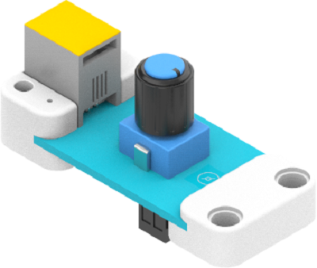
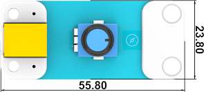
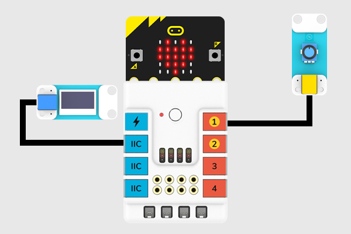

# 电位器

## 简介
模拟电位器，旋转角度300°，根据旋转角度返回0~1023的模拟值。

## 特性
---
- RJ11端口设计，防止误插，易于使用。
## 技术规格
---

项目 | 参数 
:-: | :-: 
SKU|EF05018
接口|RJ11
接口类型|模拟输出
工作电压|3.3V

## 外形与定位尺寸
---

## 快速上手
---

### 所需器材及连接示意图
---

- 如下图所示，将电位器连接到哪吒扩展板的J1端口，并将OLED显示屏连接到哪吒扩展板的IIC端口。

## 编程
---

### 步骤 1
在MakeCode的代码抽屉中点击“高级”，查看更多代码选项。

为了给电位器编程，我们需要添加一个扩展库。在代码抽屉底部找到“扩展”，并点击它。这时会弹出一个对话框，搜索”https://github.com/elecfreaks/pxt-PlanetX“，然后点击下载这个代码库。

*注意：*如果你得到一个提示说一些代码库因为不兼容的原因将被删除，你可以根据提示继续操作，或者在项目菜单栏里面新建一个项目。
### 步骤 2
### 如图所示编写程序

### 参考程序
请参考程序连接：[https://makecode.microbit.org/_0Ff9eMJT2Y5F](https://makecode.microbit.org/_0Ff9eMJT2Y5F)

你也可以通过以下网页直接下载程序，下载完成后即可开始运行程序。

<iframe style="position:absolute;top:0;left:0;width:100%;height:100%;" src="https://makecode.microbit.org/#pub:_0Ff9eMJT2Y5F" frameborder="0" sandbox="allow-popups allow-forms allow-scripts allow-same-origin"></iframe>
  
---

### 结果
- 通过OLED显示屏显示当前电位器的返回值。
## 相关案例
---

## 技术文档
---
