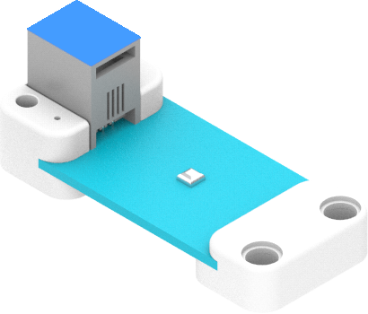
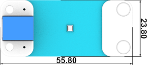

# BME280气压传感器

## 简介
BME280 气压传感器是基于数字湿度、压力和温度传感器的组合传感器，还能够根据气压值计算出海拔高度。

## 特性
---
- RJ11端口设计，防止误插，易于使用。
## 技术规格
---

项目 | 参数 
:-: | :-: 
SKU|EF05022
接口|RJ11
接口类型|IIC
工作电压|3.3V
核心IC|BME280

## 外形与定位尺寸
---

## 快速上手
---

### 所需器材及连接示意图
---

- 如下图所示，将BME280气压传感器连接到哪吒扩展板的IIC端口，并将OLED显示屏连接到哪吒扩展板的IIC端口。

## makecode编程
---

### 步骤 1
在MakeCode的代码抽屉中点击“高级”，查看更多代码选项。

为了给BME280气压传感器编程，我们需要添加一个扩展库。在代码抽屉底部找到“扩展”，并点击它。这时会弹出一个对话框，搜索”PlanetX“，然后点击下载这个代码库。

*注意：*如果你得到一个提示说一些代码库因为不兼容的原因将被删除，你可以根据提示继续操作，或者在项目菜单栏里面新建一个项目。
### 步骤 2
### 如图所示编写程序

### 参考程序
请参考程序连接：[https://makecode.microbit.org/_7z9hCwWb77zj](https://makecode.microbit.org/_7z9hCwWb77zj)

你也可以通过以下网页直接下载程序，下载完成后即可开始运行程序。

<iframe style="position:absolute;top:0;left:0;width:100%;height:100%;" src="https://makecode.microbit.org/#pub:_7z9hCwWb77zj" frameborder="0" sandbox="allow-popups allow-forms allow-scripts allow-same-origin"></iframe>
  
---

### 结果
- 通过OLED显示屏显示当前的温度值、湿度值、气压值和海拔高度。
## 相关案例
---

## 技术文档
---
