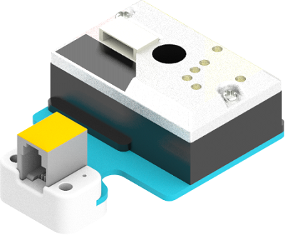
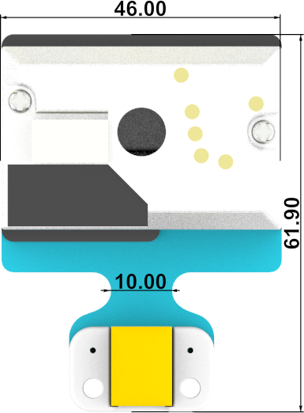
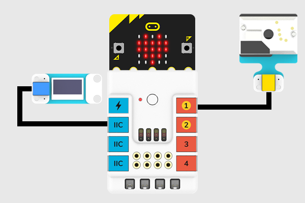

# 灰尘传感器

## 简介
灰尘传感器带有夏普GP2Y1010AU0F的通尘埃传感器检测模块采用夏普光学灰尘传感器（GP2Y1010AU0F）。 用于检测直径超过0.8μm的尘埃颗粒的密度，如香烟烟雾。



## 特性
---
- RJ11端口设计，防止误插，易于使用。
## 技术规格
---

项目 | 参数 
:-: | :-: 
SKU|EF05027
接口|RJ11
接口类型|模拟输出
工作电压|3.3V
灵敏度|0.5V /（100μg/ m3）
有效范围|500μg/ m3


## 外形与定位尺寸
---





## 快速上手
---

### 所需器材及连接示意图
---

- 如下图所示，将灰尘传感器连接到哪吒扩展板的J1端口，OLED显示屏连接到哪吒扩展板的IIC端口。




## makecode编程
---

### 步骤 1
在MakeCode的代码抽屉中点击“高级”，查看更多代码选项。


为了给灰尘传感器编程，我们需要添加一个扩展库。在代码抽屉底部找到“扩展”，并点击它。这时会弹出一个对话框，搜索”PlanetX“，然后点击下载这个代码库。


*注意：*如果你得到一个提示说一些代码库因为不兼容的原因将被删除，你可以根据提示继续操作，或者在项目菜单栏里面新建一个项目。
### 步骤 2
### 如图所示编写程序


### 参考程序
请参考程序连接：[https://makecode.microbit.org/_65HADAFizTet](https://makecode.microbit.org/_65HADAFizTet)

你也可以通过以下网页直接下载程序，下载完成后即可开始运行程序。

<div style="position:relative;height:0;padding-bottom:70%;overflow:hidden;"><iframe style="position:absolute;top:0;left:0;width:100%;height:100%;" src="https://makecode.microbit.org/#pub:_65HADAFizTet" frameborder="0" sandbox="allow-popups allow-forms allow-scripts allow-same-origin"></iframe></div>  
---

### 结果
- 通过OLED显示屏显示灰尘传感器的浓度值。

## python编程
---


### 步骤 1
为了方便的使用python对行星系列传感进行编程，我们可以使用已经编写好的库[PlanetX_MicroPython]，只需要调用函数并修改参数即可实现对应的功能。

下载压缩包并解压[PlanetX_MicroPython](https://github.com/lionyhw/PlanetX_MicroPython/archive/master.zip)

推荐使用官方平台：[Python editor](https://python.microbit.org/v/2.0)进行编程


为了给灰尘传感器编程，我们需要添加enum.py和dust.py两个文件。点击Load/Save，然后点击Show Files（1）下拉菜单，再点击Add file在本地找到下载并解压完成的PlanetX_MicroPython文件夹，从中选择enum.py和dust.py文件添加进来。


### 步骤 2
### 参考程序
```
from microbit import *
from enum import *
from dust import *

dis = DUST(J1)
while True:
    display.scroll(dis.get_dust())
    sleep(500)
```


### 结果
- 通过micro:bit的LED矩阵显示当前灰尘传感器的返回值。
## 相关案例
---

## 技术文档
---
