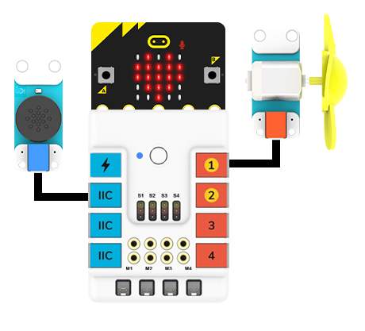

# 语音识别模块

## 简介
实现语音智能控制，如语音控制智能车前进、后退、启动巡线模式等。


## 特性
---
- RJ11端口设计，防止误插，易于使用。
## 技术规格
---

项目 | 参数 
:-: | :-: 
SKU|EF05037
接口|RJ11
接口类型|IIC
工作电压|3.3V
核心IC|SNR3512M


## 外形与定位尺寸
---


## 快速上手
---

### 所需器材及连接示意图
---

- 如下图所示，将语音识别模块连接到哪吒扩展板的IIC端口，并将风扇模块连接到哪吒扩展板的J1端口。





## makecode编程
---

### 步骤 1
在MakeCode的代码抽屉中点击“高级”，查看更多代码选项。


为了给语音识别模块编程，我们需要添加一个扩展库。在代码抽屉底部找到“扩展”，并点击它。这时会弹出一个对话框，搜索”PlanetX“，然后点击下载这个代码库。


*注意：*如果你得到一个提示说一些代码库因为不兼容的原因将被删除，你可以根据提示继续操作，或者在项目菜单栏里面新建一个项目。

### 可选词条


### 步骤 2
### 如图所示编写程序


### 参考程序
请参考程序连接：[https://makecode.microbit.org/_9j8UEEYi82tF](https://makecode.microbit.org/_9j8UEEYi82tF)

你也可以通过以下网页直接下载程序，下载完成后即可开始运行程序。

<div style="position:relative;height:0;padding-bottom:70%;overflow:hidden;"><iframe style="position:absolute;top:0;left:0;width:100%;height:100%;" src="https://makecode.microbit.org/#pub:_9j8UEEYi82tF" frameborder="0" sandbox="allow-popups allow-forms allow-scripts allow-same-origin"></iframe></div>  
---

### 结果
- 通过语音识别模块控制风扇转动。


## python编程
---


### 步骤 1

为了方便的使用python对行星系列传感进行编程，我们可以使用已经编写好的库[PlanetX_MicroPython]，只需要调用函数并修改参数即可实现对应的功能。

下载压缩包并解压[PlanetX_MicroPython](https://github.com/lionyhw/PlanetX_MicroPython/archive/master.zip)

推荐使用官方平台：[Python editor](https://python.microbit.org/v/2.0)进行编程


为了给语音识别模块编程，我们需要添加文件ASR.py。点击Load/Save，然后点击Show Files（1）下拉菜单，再点击Add file在本地找到下载并解压完成的PlanetX_MicroPython文件夹，从中选择ASR.py文件添加进来。


#语音指令以及对应的返回值

| 语音指令| 反馈音 | 返回值 | 
| :------------: | :-----------: | :-----------: |
| 你好小恩| 你好啊/我在呢 | 1 | 
| 打开车灯| 车灯已打开 | 10 | 
| 关闭车灯| 已关闭 | 11 | 
| 向左转| 左转弯 | 12| 
| 向右转| 右转弯 | 13 | 
| 向前进| 全速前进 | 14 | 
| 向后退| 倒车请注意 | 15 | 
| 巡线模式| 进入巡线模式 | 16 | 
| 避障模式| 进入避障模式 | 17 | 
| 停车| 已停车 | 18 | 
| 启动设备| 设备运行 | 20 | 
| 停止设备| 设备关闭 | 21 | 
| 暂停运行| 休息一下 | 22 | 
| 继续运行| 开始工作啦 |23 | 
| 增加一档| 已增加 | 24 | 
| 降低一档| 已降低 | 25 | 
| 播放音乐| 欣赏音乐吧 | 26 | 
| 关闭音乐| 已关闭 | 27 | 
| 切换音乐| 欣赏下一首音乐 | 28 | 
| 执行功能一| 执行功能一 | 31 | 
| 执行功能二| 执行功能二 | 32 | 


### 步骤 2
### 参考程序
```
from microbit import *
from ASR import *

asr = ASR()
        

while True:
    display.scroll(asr.get_ASR())
```


### 结果
- LED矩阵显示语音识别模块的返回值。

## 相关案例
---

## 技术文档
---
