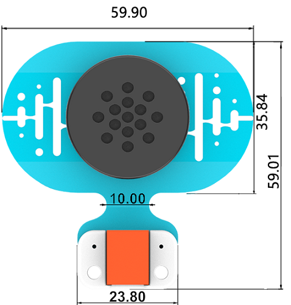

# MP3模块

## 简介
用于播放音乐。


## 特性
---
- RJ11端口设计，防止误插，易于使用。
## 技术规格
---

项目 | 参数 
:-: | :-: 
SKU|EF05038
接口|RJ11
接口类型|数字输入
工作电压|3.3V
核心IC|SNR3512M


## 外形与定位尺寸
---





## 快速上手
---

### 所需器材及连接示意图
---

- 如下图所示，将语音识别模块连接到哪吒扩展板的IIC端口，并将MP3模块连接到哪吒扩展板的J1端口。


## makecode编程
---

### 步骤 1
在MakeCode的代码抽屉中点击“高级”，查看更多代码选项。


为了给MP3模块编程，我们需要添加一个扩展库。在代码抽屉底部找到“扩展”，并点击它。这时会弹出一个对话框，搜索”PlanetX“，然后点击下载这个代码库。


*注意：*如果你得到一个提示说一些代码库因为不兼容的原因将被删除，你可以根据提示继续操作，或者在项目菜单栏里面新建一个项目。
### 步骤 2
### 如图所示编写程序


### 参考程序
请参考程序连接：[https://makecode.microbit.org/_6L7Mdji6t85Y](https://makecode.microbit.org/_6L7Mdji6t85Y)

你也可以通过以下网页直接下载程序，下载完成后即可开始运行程序。

<div style="position:relative;height:0;padding-bottom:70%;overflow:hidden;"><iframe style="position:absolute;top:0;left:0;width:100%;height:100%;" src="https://makecode.microbit.org/#pub:_6L7Mdji6t85Y" frameborder="0" sandbox="allow-popups allow-forms allow-scripts allow-same-origin"></iframe></div>  
---

### 结果
- 通过语音识别模块控制MP3模块播放音乐。

### 注意


## python编程
---


### 步骤 1
下载压缩包并解压[PlanetX_MicroPython](https://github.com/lionyhw/PlanetX_MicroPython/archive/master.zip)
打开[Python editor](https://python.microbit.org/v/2.0)


为了给MP3时钟模块编程，我们需要添加mp3.py和enum.py这两个文件。点击Load/Save，然后点击Show Files（1）下拉菜单，再点击Add file在本地找到下载并解压完成的PlanetX_MicroPython文件夹，从中选择mp3.py和enum.py两个文件添加进来。


### 步骤 2
### 参考程序
```
from microbit import *
from enum import *
from mp3 import *
player = MP3(J1)
while True:
    if button_a.is_pressed():
        player.exeCute(Play)
    elif button_b.is_pressed():
        player.exeCute(Pause)
```


### 结果
- micro:bit的LED矩阵显示RTC时钟模块返回的秒数。
## 相关案例
---

## 技术文档
---
