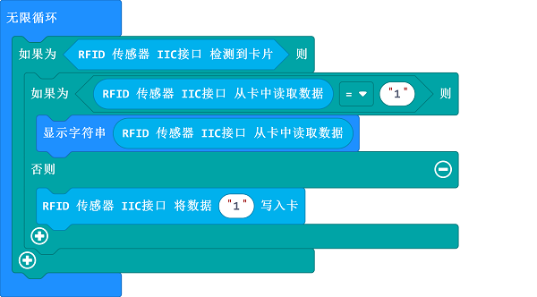

# RFID传感器

## 简介
RFID传感器利用无线射频方式对记录媒体（电子标签或射频卡）进行读写，从而达到识别目标和数据交换的目的。

## 特性
---
- RJ11端口设计，防止误插，易于使用。
## 技术规格
---

项目 | 参数 
:-: | :-: 
SKU|EF05047
接口|RJ11 4P4C
接口类型|IIC通信
工作电压|3.3V
额定电流|50mA
核心IC|PN5321A3

## 外形与定位尺寸
---

## 快速上手
---

### 所需器材及连接示意图
---

- 如下图所示，将RFID传感器连接到哪吒扩展板的IIC端口。

---

## makecode编程
---

### 步骤 1
在MakeCode的代码抽屉中点击“高级”，查看更多代码选项。

为了给RFID传感器编程，我们需要添加一个扩展库。在代码抽屉底部找到“扩展”，并点击它。这时会弹出一个对话框，搜索”PlanetX“，然后点击下载这个代码库。

*注意：*如果你得到一个提示说一些代码库因为不兼容的原因将被删除，你可以根据提示继续操作，或者在项目菜单栏里面新建一个项目。
### 步骤 2
### 如图所示编写程序

请参考程序连接：[https://makecode.microbit.org/_fXU8hWYc9Lhu](https://makecode.microbit.org/_fXU8hWYc9Lhu)

你也可以通过以下网页修改程序。

<iframe style="position:absolute;top:0;left:0;width:100%;height:100%;" src="https://makecode.microbit.org/#pub:_fXU8hWYc9Lhu" frameborder="0" sandbox="allow-popups allow-forms allow-scripts allow-same-origin"></iframe>
  

### 现象
---
当开机时，将电子标签放置在RFID下方，RFID将数据写入电子标签，然后读取电子标签数据并显示在micro:bit的点阵屏上。
