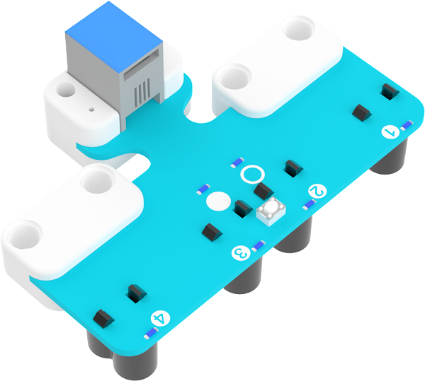
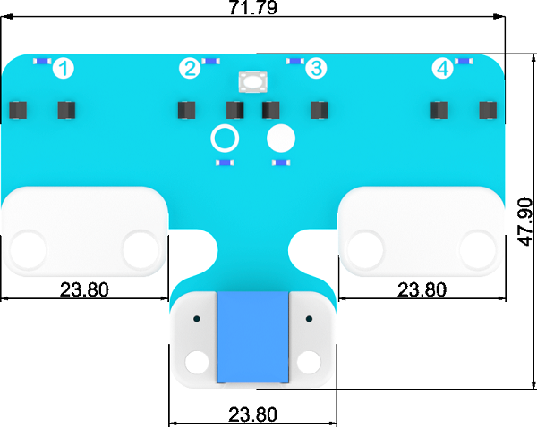
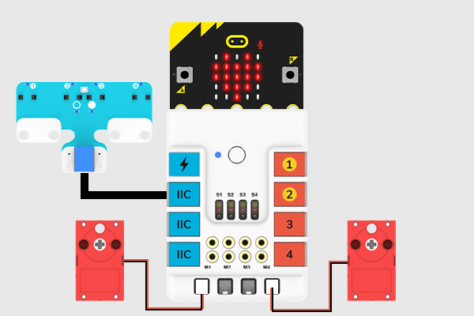
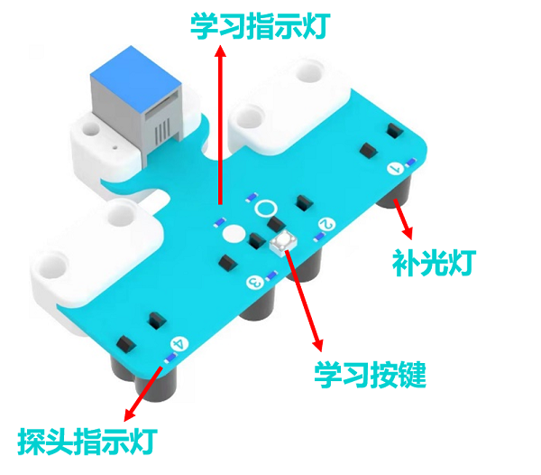

# 四路巡线传感器

## 简介

四路巡线模块集成了四组光敏接收管及补光灯，统称探头。它能分辨黑线和白线。同时，巡线传感带自主学习功能，适应更多不同灰度的颜色。

## 特性

RJ11端口设计，防止误插，易于使用。

## 技术规格

项目 | 参数 
:-: | :-: 
SKU|EF05053
接口|RJ11
接口类型|IIC
工作电压|3.3V
产品尺寸|71.79 x 47.9 mm
有效区间|8~16 mm

## 外形与定位尺寸

## 快速上手

### 连接示意图

如下图所示，将四路巡线传感器连接到哪吒扩展板的IIC 端口，并将两个电机分别连接至哪吒扩展板的 M1 和 M4 接口。

### 学习模式

四路巡线传感器可通过按下传感器上的按键来学习地图背景和巡线轨迹（即黑色赛道）。按照以下步骤完成学习：

①将四路巡线传感器探头正对地图背景区域并按下学习按键；

②此时 1~4 号探头指示灯倒序依次点亮，两个学习指示灯交替闪烁；

③当巡线探头补光灯发出彩光并高频闪烁，此时应将巡线探头在背地图景和巡线轨迹上来回水平移动；

④一直来回移动，直到巡线探头补光灯停止闪烁，学习完成。

注意：使用时巡线探头的离地高度应在 8mm~16mm之间。

学习成功后，两个学习指示灯会熄灭，当巡线探头检测到巡线轨迹时，对应的探头指示灯灯会点亮。当学习失败时，空心圆、实心圆 LED 同时快闪，补光RGB 灯熄灭。

## makecode编程

### 步骤 1
在MakeCode的代码抽屉中点击“高级”，查看更多代码选项。

为了给四路巡线传感器编程，我们需要添加一个扩展库。在代码抽屉底部找到“扩展”，并点击它。这时会弹出一个对话框，搜索”PlanetX“，然后点击下载这个代码库。

为了给哪吒扩展板编程，我们需要添加一个扩展库。在代码抽屉底部找到“扩展”，并点击它。这时会弹出一个对话框，搜索”nezha“，然后点击下载这个代码库。

*注意：*如果你得到一个提示说一些代码库因为不兼容的原因将被删除，你可以根据提示继续操作，或者在项目菜单栏里面新建一个项目。
### 步骤 2
### 如图所示编写程序
示例一：数字巡线示例代码

### 参考程序
请参考程序连接：[https://makecode.microbit.org/_URyg36djehfc](https://makecode.microbit.org/_URyg36djehfc)

你也可以通过以下网页直接下载程序，下载完成后即可开始运行程序。

<iframe style="position:absolute;top:0;left:0;width:100%;height:100%;" src="https://makecode.microbit.org/#pub:_URyg36djehfc" frameborder="0" sandbox="allow-popups allow-forms allow-scripts allow-same-origin"></iframe>
  

示例二：PID巡线示例代码

积木块介绍：

返回值为四路巡线传感器中心点偏离黑线的偏移量，范围-3000~3000.

示例程序：

### 参考程序
请参考程序连接：[https://makecode.microbit.org/_dH4Df4LM5Xii](https://makecode.microbit.org/_dH4Df4LM5Xii)

你也可以通过以下网页直接下载程序，下载完成后即可开始运行程序。

<iframe style="position:absolute;top:0;left:0;width:100%;height:100%;" src="https://makecode.microbit.org/#pub:_dH4Df4LM5Xii" frameborder="0" sandbox="allow-popups allow-forms allow-scripts allow-same-origin"></iframe>
  

### 结果
小车沿着黑线行驶。

