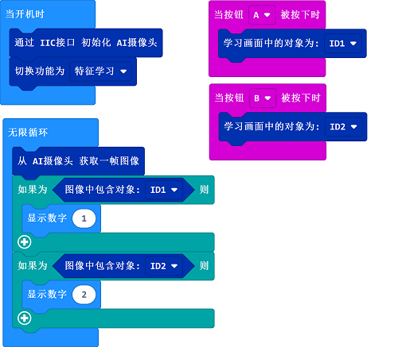

# 特征学习

## 目的
让你的AI摄像头通过一键学习识别物体。

---

### 所需器材及连接示意图
---

- 如下图所示，将AI摄像头连接到哪吒扩展板的IIC端口。

## makecode编程
---

### 步骤 1
在MakeCode的代码抽屉中点击“高级”，查看更多代码选项。

为了AI摄像头编程，我们需要添加一个扩展库。在代码抽屉底部找到“扩展”，并点击它。这时会弹出一个对话框，搜索”PlanetX“，然后点击下载这个代码库。

*注意：*如果你得到一个提示说一些代码库因为不兼容的原因将被删除，你可以根据提示继续操作，或者在项目菜单栏里面新建一个项目。
### 步骤 2

### 如图所示编写程序

### 参考程序
请参考程序连接：[https://makecode.microbit.org/_46c9WCd5oc1z](https://makecode.microbit.org/_46c9WCd5oc1z)

你也可以通过以下网页直接下载程序，下载完成后即可开始运行程序。

<iframe style="position:absolute;top:0;left:0;width:100%;height:100%;" src="https://makecode.microbit.org/#pub:_46c9WCd5oc1z" frameborder="0" sandbox="allow-popups allow-forms allow-scripts allow-same-origin"></iframe>
  
---

### 结果
- 按下A键学习物品，ID为1；按下B键学习物品，ID为2；当学习完成后再将物体放置在摄像头前，在micro:bit的LED矩阵屏上会显示当前物体的ID。

