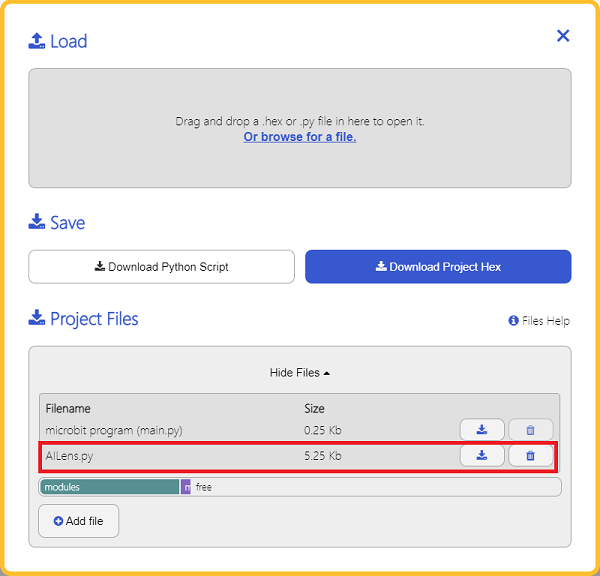

# AI摄像头

## 简介
AI摄像头，可以实现人脸识别、小球追踪、卡片识别和一键学习的功能。


## 特性
---
- RJ11端口设计，防止误插，易于使用。
## 技术规格
---

项目 | 参数 
:-: | :-: 
SKU|EF05044
接口|RJ11
接口类型|IIC
工作电压|3.3V
核心IC|K210


## 外形与定位尺寸
---


## 使用RJ11转杜邦线的接线方式
---

当使用没有RJ11扩展接口的micro:bit扩展板时，可以使用RJ11转杜邦线的连接线，将RJ11接口连接摄像头，杜邦线接口的一端黑线接GND，红线接VCC，绿线接P19（SDA）端口，黄线接P20（SCL）端口；如果使用过程中摄像头无法启动，请尝试给AI摄像头单独供电。


以iot:bit为例：


注意：

1.当使用哪吒扩展板之外的micro:bit扩展板连接AI摄像头时，添加扩展库应搜索
 [https://github.com/elecfreaks/pxt-PlanetX-AI](https://github.com/elecfreaks/pxt-PlanetX-AI)

2.当使用一键学习功能时，如果重启电源，则需要对物品重新进行学习。

3.下载程序后，如果发现AI摄像头处于启动页，无法正常运行，需要完全断电然后重启，保证AI摄像头初始化成功。


## 添加python文件

为了方便的使用python对AI摄像头进行编程，我们可以使用已经编写好的库[EF_Produce_MicroPython-master](https://github.com/lionyhw/EF_Produce_MicroPython/archive/master.zip)，只需要调用函数并修改参数即可实现对应的功能。

下载压缩包并解压[EF_Produce_MicroPython-master](https://github.com/lionyhw/EF_Produce_MicroPython/archive/master.zip)

打开[Python editor](https://python.microbit.org/v/2.0)


为了给AI摄像头编程，我们需要添加AILens.py这个文件。点击Load/Save，然后点击Show Files（1）下拉菜单，再点击Add file在本地找到下载并解压完成的EF_Produce_MicroPython-master文件夹，从中选择AILens.py这个文件添加进来。



### API
| API | 描述 | 
| :------------: | :-----------: |
|`AILENS()`|初始化AI摄像头模块。|
|`switch_function(func)`|选择摄像头功能，`func`选择功能：（`Learn`特征学习；`Card`卡片识别；`Face`人脸识别；`Tracking`巡线识别；`Color`颜色识别；`Ball`小球识别）。|
|`get_card_content()`|识别卡片内容。|
|`get_card_data()`|用列表的方式返回画面中卡片的信息：（X轴坐标、Y轴坐标、宽度、高度、置信度、图像中卡片总数、当前卡片ID）。|
|`get_face()`|判断画面中是否存在人脸。|
|`get_face_data()`|用列表的方式返回画面中人脸的信息：（X轴坐标、Y轴坐标、宽度、高度、置信度、图像中人脸总数、当前人脸ID）。|
|`get_ball_color()`|检测画面中的小球颜色|
|`get_ball_data()`|用列表的方式返回画面中小球的信息：（X轴坐标、Y轴坐标、宽度、高度、置信度、图像中小球总数、当前小球ID）。|
|`get_track_data()`|用列表的方式返回画面中线段的信息：（偏移角度、偏移距离、线段长度）。|
|`get_color_type()`|检测画面中的卡片颜色|
|`get_color_data()`|用列表的方式返回画面中的颜色信息：（X轴坐标、Y轴坐标、宽度、高度、置信度、图像中颜色总数、当前颜色ID）。|
|`learn_object(learn_id)`|以ID号来学习一个物品，ID号：1~5。|
|`get_learn_data()`|用列表的方式返回画面中已学习物品的信息：（物品ID、置信度）。|

`class AILENS(object)`

初始化AI摄像头模块。

`def switch_function(self, func)`

选择摄像头功能，`func`选择功能：（`Learn`特征学习；`Card`卡片识别；`Face`人脸识别；`Tracking`巡线识别；`Color`颜色识别；`Ball`小球识别）。

`def get_image(self)`

获取一帧画面

`def get_ball_color(self):`

检测画面中的小球颜色，返回值（当检测到蓝色小球时，返回值为'Blue'，当检测到红色小球时，返回值为'Red'，否则返回‘No Ball’。）

`def get_ball_data(self)`

返回画面中小球的信息，BallData [x,y,w,h,confidence,total,order]。

x：X轴坐标

y：Y轴坐标

w：宽度

h：高度

confidence：置信度

total：图像中小球总数

order：当前小球ID

`def get_face(self)`

判断画面中是否存在人脸

`def get_face_data(self)`

返回画面中人脸的信息，FaceData [x,y,w,h,confidence,total,order]。

x：X轴坐标

y：Y轴坐标

w：宽度

h：高度

confidence：置信度

total：图像中人脸总数

order：当前人脸ID

`def get_card_content(self)`

返回卡片内容，可能的返回值：

numberCards = ["0", "1", "2", "3", "4", "5", "6", "7", "8", "9"]

letterCards = ["A", "B", "C", "D", "E"]

otherCards = ["Mouse", "micro:bit", "Ruler", "Cat", "Peer", "Ship", "Apple", "Car", "Pan", "Dog", "Umbrella", "Airplane", "Clock", "Grape", "Cup", "Turn left", "Turn right", "Forward", "Stop", "Back"]

当没有检测到卡片时，返回值为‘No Card’

`def get_color_type(self)`

返回卡片颜色，可能返回的颜色：

绿色卡片："Green"

蓝色卡片："Blue"

黄色卡片："Yellow"

黑色卡片： "Black"

红色卡片： "Red"

白色卡片： "White"

当没有检测到颜色卡片的时候，显示‘No Color’

`def get_color_data(self)`

 返回画面中颜色的信息，ColorData [x,y,w,h,confidence,total,order]

x：X轴坐标

y：Y轴坐标

w：宽度

h：高度

confidence：置信度

total：图像中颜色总数

order：当前颜色ID

`def get_track_data(self)`

返回画面中线段的信息：LineData [angel,width,len]

angel：返回图像中线段的偏移角度

width：返回图像中线段的偏移距离

len：返回图像中线段的线段长度

`def learn_object(self, learn_id)`

以ID号来学习一个物品,

要学习的ID号:learn_id

`def get_learn_data(self)`

返回画面中已学习物品的信息,返回信息：LearnData [ID,confidence]

物品ID：ID

所学习物品的置信度：confidence


### 示例代码
### 示例一     特征学习
```
from microbit import *
from AILens import *
ai = AILENS()
ai.switch_function(Learn)
while True:
    ai.get_image()
    if button_a.is_pressed():
        ai.learn_object(1)
    buff = ai.get_learn_data()
    if buff[0] == 1:
        display.show(Image.HAPPY)
    else:
        display.show(Image.SAD)


```
### 结果
- 按下A键学习物品，当识别到所学习的物品时，显示笑脸，否则显示哭脸。


### 示例二    颜色识别
```
from microbit import *
from AILens import *
ai = AILENS()
ai.switch_function(Color)
while True:
    ai.get_image()
    if (ai.get_color_type() == "Green"):
        display.show(Image.HAPPY)
        sleep(2000)
    else:
        display.show(Image.SAD)
```
### 结果
- 当识别到绿色卡片的时候，显示笑脸两秒，否则显示哭脸。

### 示例三    小球识别
```
from microbit import *
from AILens import *
ai = AILENS()
ai.switch_function(Ball )
while True:
    ai.get_image()
    if (ai.get_ball_color() == "Red"):
        display.show(Image.HAPPY)
        sleep(2000)
    else:
        display.show(Image.SAD)
```
### 结果
- 当识别到红色小球的时候，显示笑脸两秒，否则显示哭脸。

### 示例四    识别黑线
```
from microbit import *
from AILens import *
ai = AILENS()
ai.switch_function(Tracking)
while True:
    ai.get_image()
    buff = ai.get_track_data()
    
    if buff[1] > 100:
        display.show(Image.HAPPY)
    else:
        display.show(Image.SAD)
```
### 结果
- 当摄像头中的黑线偏向左边时，LED矩阵显示哭脸，当黑线偏向右边时，LED矩阵显示笑脸。

### 示例五    识别人脸 
```
from microbit import *
from AILens import *
ai = AILENS()
ai.switch_function(Face )
while True:
    ai.get_image()
    
    if ai.get_face():
        display.show(Image.HAPPY)
    else:
        display.show(Image.SAD)
```
### 结果
- 当识别到人脸时显示笑脸，否则显示哭脸。

### 示例六   识别卡片
```
from microbit import *
from AILens import *
ai = AILENS()
ai.switch_function(Card)
while True:
    ai.get_image()
    
    if (ai.get_card_content() == "Stop"):
        display.show(Image.HAPPY)
        sleep(2000)
    else:
        display.show(Image.SAD)
```
### 结果
- 当识别到“停止”卡片时显示笑脸，否则显示哭脸。


## AI摄像头固件下载步骤

为了给AI摄像头下载固件，我们需要安装固件下载软件kflash，下载[kflash_gui_v1.6.5_2_windows.7z](https://github.com/elecfreaks/learn-cn/raw/master/microbitplanetX/ai/kflash_gui_v1.6.5_2_windows.7z)并解压。
解压完成后打开文件夹kflash_gui，找到kflash_gui.exe程序。


双击打开kflash_gui.exe程序，点击打开文件，在文件夹中选择并打开固件v0.4.3.kfpkg，固件v0.4.3.kfpkg下载链接[v0.4.3.kfpkg](https://github.com/elecfreaks/learn-cn/raw/master/microbitplanetX/ai/v0.4.3.kfpkg)。


然后使用USB连接AI摄像头。


最后选择端口，并点击下载即可，然后等待下载完成即可


