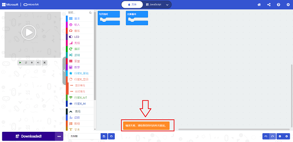
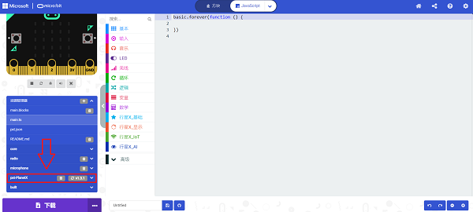
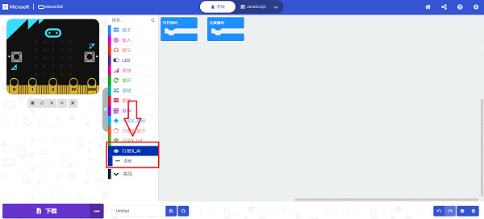
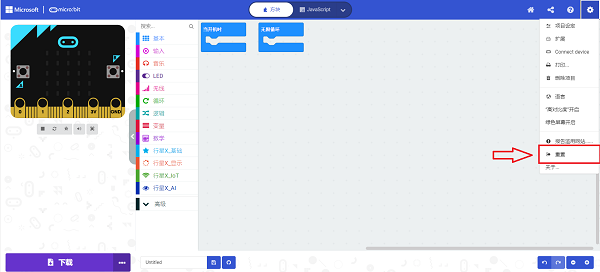

# AI摄像头

## 简介
AI摄像头，可以实现人脸识别、小球追踪、卡片识别和一键学习的功能。

## 特性
---
- RJ11端口设计，防止误插，易于使用。
## 技术规格
---

项目 | 参数 
:-: | :-: 
SKU|EF05044
接口|RJ11
接口类型|IIC
工作电压|3.3V
核心IC|K210

AI摄像头的原点（0,0）在屏幕的左下角，X轴和Y轴的范围为：X（0,224），Y（0,224）。

## 外形与定位尺寸
---

## 使用RJ11转杜邦线的接线方式
---

当使用没有RJ11扩展接口的micro:bit扩展板时，可以使用RJ11转杜邦线的连接线，将RJ11接口连接摄像头，杜邦线接口的一端黑线接GND，红线接VCC，绿线接P19（SCL）端口，黄线接P20（SDA）端口；如果使用过程中摄像头无法启动，请尝试给AI摄像头单独供电。

以iot:bit为例：

注意：

1.当使用哪吒扩展板之外的micro:bit扩展板连接AI摄像头时，添加扩展库应搜索PlanetX-AI

2.当使用一键学习功能时，如果重启电源，则需要对物品重新进行学习。

3.下载程序后，如果发现AI摄像头处于启动页，无法正常运行，需要完全断电然后重启，保证AI摄像头初始化成功。

## AI摄像头固件更新

AI摄像头会不定期更新一些新功能和性能优化，在发布新版本固件后，需要手动对AI摄像头进行固件更新。

### 如何检查当前版本

摄像头开机页面右下角会提示当前版本号，（如果没有提示，则是最旧的版本请及时更新）

### 最新版本固件

最新版固件 v1.0.12 [点击下载](https://github.com/elecfreaks/learn-cn/raw/master/microbitplanetX/ai/v1.0.12.kfpkg)。

### 如何更新固件

1.首先安装摄像头串口驱动程序：

windows系统下载[CH341SerSetup.exe](https://github.com/elecfreaks/learn-cn/raw/master/microbitplanetX/ai/CH341SerSetup.exe)并解压。

macOS系统下载[CH34x_Install_V1.5.pkg](https://github.com/elecfreaks/learn-cn/raw/master/microbitplanetX/ai/CH34x_Install_V1.5.pkg)。

2.安装固件下载软件kflash。

windows系统下载[kflash_gui_v1.6.5_2_windows.7z](https://github.com/elecfreaks/learn-cn/raw/master/microbitplanetX/ai/kflash_gui_v1.6.5_2_windows.7z)。

macOS系统下载[kflash_gui_v1.6.5_2_macOS.dmg](https://github.com/elecfreaks/learn-cn/raw/master/microbitplanetX/ai/kflash_gui_v1.6.5_2_macOS.dmg)。

windows系统解压完成后打开文件夹kflash_gui，找到kflash_gui.exe程序。

macOS系统下载完成后打开下图图标。

3.双击打开kflash_gui.exe程序，点击打开文件，在文件夹中选择并打开 最新版固件 v1.0.12 [点击下载](https://github.com/elecfreaks/learn-cn/raw/master/microbitplanetX/ai/v1.0.12.kfpkg)。

然后使用USB连接AI摄像头。

最后选择端口（不同电脑端口号可能会有差异），并点击下载即可，然后等待下载完成即可

### FAQ

1.如果在macOS系统下，安装固件下载软件的过程中遇到了由于无法验证开发者而无法安装的情况。

请访问[https://support.apple.com/zh-cn/HT202491](https://support.apple.com/zh-cn/HT202491)获取解决方法。

2.当使用AI摄像头时，点击下载出现错误提示，可能是PlanetX的软件库已经损坏。

可能是以下两种情况：
（1）软件库较为老旧，请新建项目，重新添加软件库再进行测试。

（2）同时添加PlanetX软件库和PlanetX-AI软件库冲突，请点击图中红框位置“JaveScript”切换编程界面，点击资源管理器，按需删除planet的软件库或者planet-ai的软件库；

删除后资源管理器应该不再出现错误提示；

如果删除后发现视觉识别积木块丢失，请尝试重新添加对应的软件库，如果重新添加软件库无法解决此问题，请按下图所示重置makecode编程平台，注意：重置平台后所有保存在makecode上的项目都会被清理，注意保存项目文件到电脑中。

