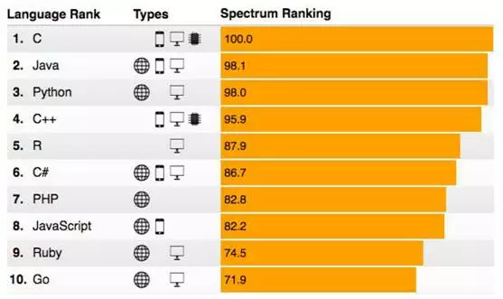

## 1.2 什么是Python ##
----------

- [Python](https://baike.baidu.com/item/Python/407313?fr=aladdin#reference-[2]-21087-wrap) 是一门简单易学且功能强大的编程语言。它拥有高效的高级数据结构，并且能够用简单而又高效的方式进行面向对象编程。
- Python 优雅的语法和动态类型，再结合它的解释性，使其在大多数平台的许多领域中成为编写脚本或开发应用程序的理想语言。
2017年8月,IEEE Spectrum 杂志(美国电气电子工程师学会出版的旗舰杂志)发布了一年一度的编程语言排行榜，在最受欢迎编程语言排行榜中Python已经跃居第三。
- 

### Python的优缺点 ####

#### 优点 ####

1. **简单**：Python是一种代表简单主义思想的语言。阅读一个良好的Python程序就感觉像是在读英语一样。它使你能够专注于解决问题而不是去搞明白语言本身。
2. **易学**：Python极其容易上手，因为Python有极其简单的说明文档。
3. **丰富的库**：Python标准库确实很庞大。它可以帮助处理各种工作，包括文档生成、单元测试、线程、数据库、网页浏览器、CGI、FTP、电子邮件、XML、XML-RPC、HTML、WAV文件、密码系统、GUI（图形用户界面）、Tk和其他与系统有关的操作。

#### 缺点 ####

1. **缓慢**：相比起C和C++语言，Python的代码运行速度相对较慢。
2. **不能加密**：如果要发布你的Python程序，实际上就是发布源代码，这一点跟C语言不同，C语言不用发布源代码，只需要把编译后的机器码发布出去。要从机器码反推出C代码是不可能的，所以，凡是编译型的语言，都没有这个问题，而解释型的语言，则必须把源码发布出去。

### 为什么要学习Python ###

- 因python的入门简单，代码简洁明了，对于初学者和完成普通任务时是最好的语言选择。
- BBC micro:bit使用的Python版本称为*MicroPython*。 非常适合那些想要继续深入学习编程的人群，用一系列代码段、各种预制图像和音乐帮助你进行编程。 由全球Python社区提供赞助。

#### 相关链接 ####

MicroPython官方链接：[http://microbit.org/zh-CN/guide/python/](http://microbit.org/zh-CN/guide/python/)
