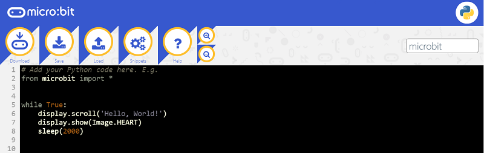
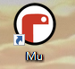
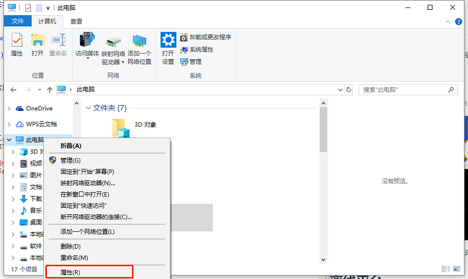
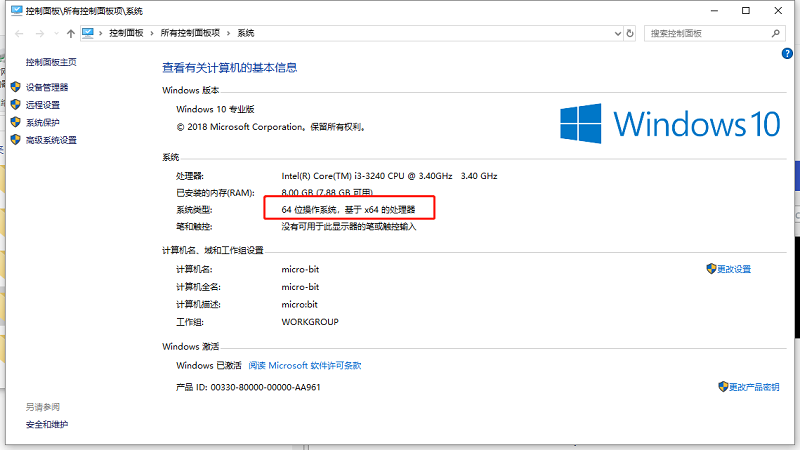
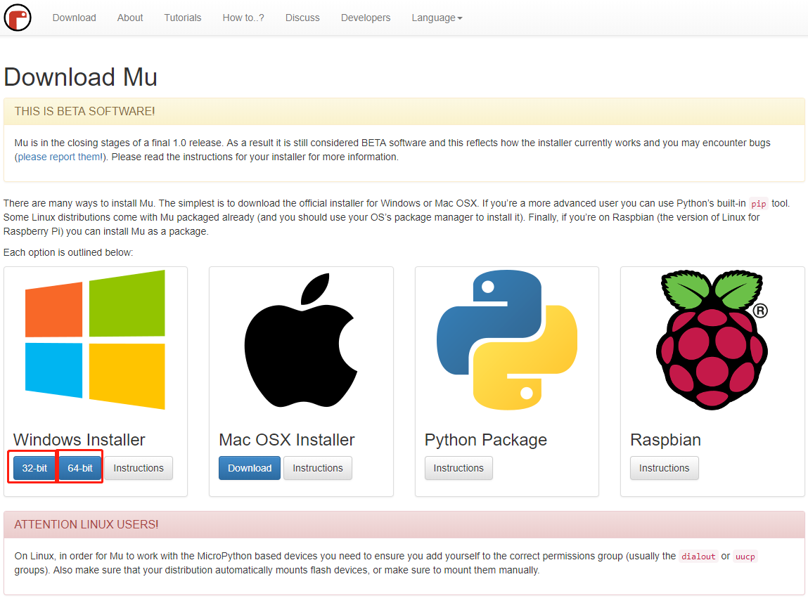
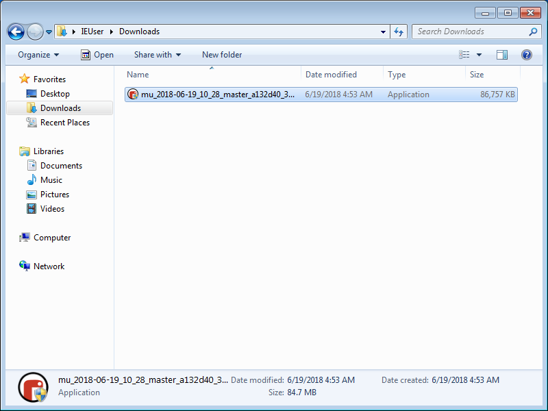
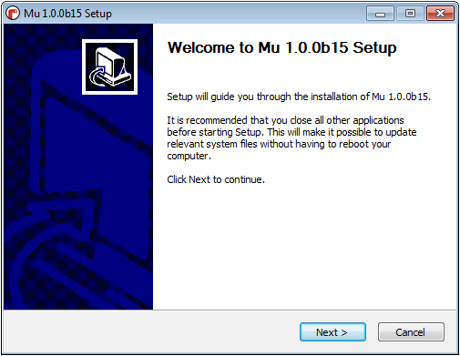
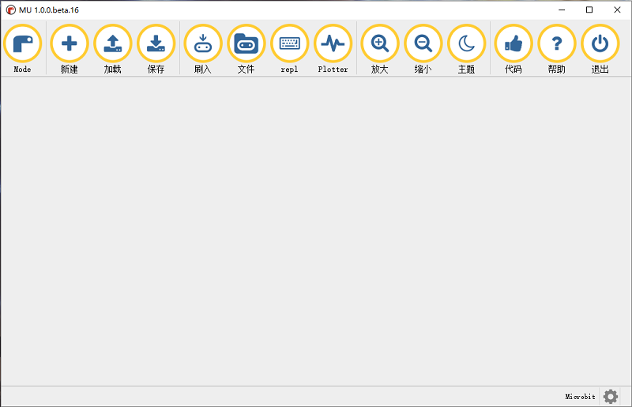

## 1.3 工具及环境 ##

> Micro:bit提供网页在线工具和可以安装在本地的离线工具。

### 在线工具

- Micro:bit官方链接地址：[http://python.microbit.org/v/1](http://python.microbit.org/v/1)

- Micro:bit官方在线代码编写平台，使用常用浏览器直接打开上述网址即可使用。

### 离线平台

- Micro:bit官方也推出了一个离线的编译工具MU，方便在没有网络连接的时候也可以进行创意和教学。
- 本教程也基于在本地离线模式使用MU完成教学实验。

### 如何使用官方安装程序在Windows上安装Mu

#### 第1步 - 确定版本并且下载Mu安装程序
- 了解您的计算机是Windows系统还是Mac OSX系统
- 了解您的Windows系统是32位还是64位。
- 打开资源管理器，鼠标右键点击"此电脑"，并选择属性。

	
	
- 查看系统类别，64位系统或者32位系统。
	
	

- 打开[https://codewith.mu/en/download](https://codewith.mu/en/download)下载对应的版本。

	

#### 第2步 - 运行安装程序

- 双击打开安装文件。

	

	 

- 根据软件提示完成安装。  
*温馨提示：Mac OSX系统使用方法与Windows类似，本教程不做赘述。*
*温馨提示：Mu正处于1.0最终版本的最后阶段，仍然被认为是BETA软件，所以Windows会提出警告，请忽略警告继续完成安装。*

#### 第3步 - 开始使用MU

- 打开你的MU。

	

- MU的主界面如下图所示。

	
