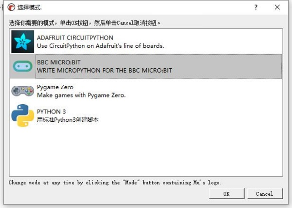
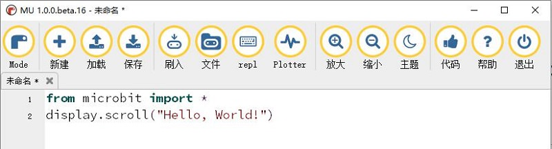
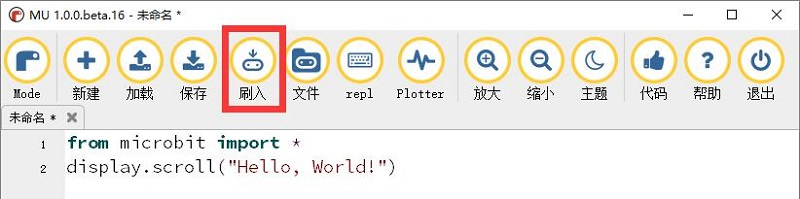
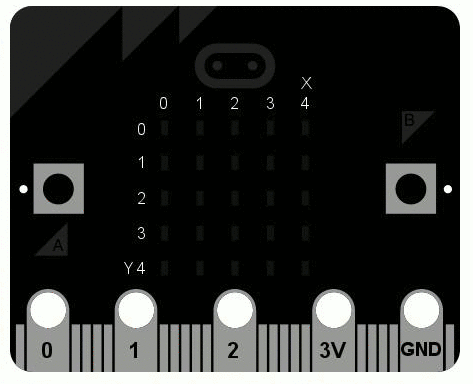

## 2.1 Hello World ##
----------

- [Hello World](http://microbit.org/) 中文意思是『你好,世界』，指的是只在计算机屏幕上输出“Hello, World!”这行字符串的计算机程序，一般来说，这是每一种计算机编程语言中最基本、最简单的程序，亦通常是初学者所编写的第一个程序。它还可以用来确定该语言的编译器、程序开发环境，以及运行环境是否已经安装妥当。因为《The C Programme Language》中使用它做为第一个演示程序非常著名，所以后来的程序员在学习编程或进行设备调试时延续了这一习惯。

	

### Micro:bit显示Hello World ###
----------

打开MU，选择模式为BBC MICRO:BIT。

将下图所示代码输入到MU的编辑区中。

连接好Micro:bit，点击刷入。

Micro:bit的USB端口旁边LED灯会闪烁一会，闪烁结束后代表代码刷入结束。

Micro:bit的5X5点阵显示屏会滚动显示“Hello，World！”

这样你就完成了一个简单程序烧录，所有的程序烧录都是类似，接下来了解“`Helloword`”的Python代码是怎样的结构。
