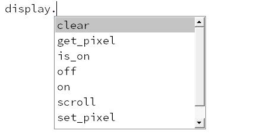
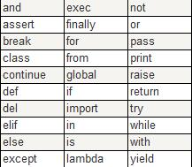

## 2.3 Python中的基础语法 ##
----------
### Python代码详解 ###


- `display.scroll("Hello, World!")`

- 这样代码中`display`为microbit的***对象***，他是我们需要操控的模块，在他之后的代码为对他操作的方式。
- 用`.`运算符点出他可以操作的方式(如图所示)称之为***方法***。

	

- 方法关键字后边的括号中为***方法***的内容称之为***参数***，如果一个***方法***中不需要参数那么就用空括号`()`代表***参数***。
- 总体来说`对象.方法(参数)`,为micropython的基本语法。

### Python中的标识符 ###
----------
- 在 Python 里，标识符由字母、数字、下划线(_)组成，但不能以数字开头。
- Python会保留一些字符用来做特殊用途，这些保留字不能用作常数或变数，或任何其他标识符名称。

	

### Python中的注释 ###
----------

- Python不会执行注释，因此我们可以添加注释来对 Python 进行解释，或者提高代码的可读性，尤其在写了大段的代码后可以一目了然理解程序结构。
- 单行注释以#开始。

```Python
	from microbit import * #导入文件
		display.scroll("Hello, World!") #滚动显示字符串
```

- 因为Python不会执行注释，所以我们可以用注释来控制代码的运行，像是一个注释开关。
- 如下代码，第二行的display因为被注释掉所以不会运行，Microbit就不会显示Helloworld了。

```Python
	from microbit import * #导入文件
		# display.scroll("Hello, World!") 
```

- 有时候我们想注释掉很多行代码来控制版本，需要用到双引号`""`或者单引号`''`，具体用法如下。

```Python

	'''
	这是多行注释，使用单引号。
	'''

	"""
	这是多行注释，使用双引号。
	"""
#下边是例子，注释掉了elif语句。
	while True:
   	 if button_a.get_presses():
   	     current_emotion = max(current_emotion - 1, 0)
	'''
   	 elif button_b.get_presses():
   	     current_emotion = min(current_emotion + 1, 4)
	'''
   	 display.show(emotions[current_emotion])	

```
- 在代码不确定哪里出错的时候，可以一步一步注释来查找错误，就不需要把代码都删掉重写了。
