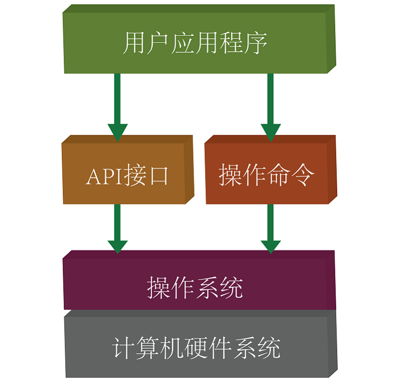

## 2.4 什么是API ##
----------
### api (应用程序编程接口) ###
	
- [API (Application Programming Interface,应用程序编程接口)](https://baike.baidu.com/item/api/10154)是一些预先定义的函数，目的是提供应用程序与开发人员基于某软件或硬件得以访问一组例程的能力，而又无需访问源码，或理解内部工作机制的细节。

- 对于很多初学者来说，枯燥的底层代码，和复杂的硬件原理都是非常难以入手的地方，应用程序编程接口就解决了这个问题，将底层代码封装成一个可以调用的函数***（方法）***，用户编写的应用程序中只需要调用这个方法使用封装好的API就可以完成操作硬件的相关功能。
- MicroPython的API都封装在microbit这个代码库里，在每个程序的开头都需要import这个代码库来使用这些方法。

### MicroPython的API ###

- MicroPython中的API在HelloWorld中已经有一个示例，滚动显示字符串的方法，`.scroll()`即为一个API，我们不需要知道显示屏如何工作，只知道这样可以完成相应的功能即可。
- MicroPython中还有很多API，相关的API在下边的章节会继续介绍。

### 相关链接 ###

- MicroPython相关API官方文档：[http://microbit-micropython.readthedocs.io/en/latest/index.html](http://microbit-micropython.readthedocs.io/en/latest/index.html)
- 菜鸟网Python教程：[http://www.runoob.com/python/python-tutorial.html](http://www.runoob.com/python/python-tutorial.html)
