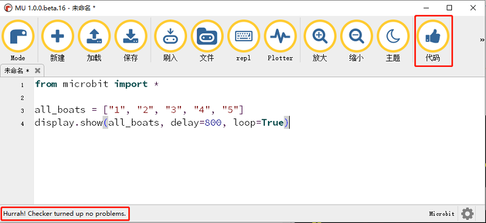

## 3.4 演示案例 ##
----------
#### 循环显示字符123456 ####

- 使用列表和display.show这个API来完成一个循环显示。

```python

	from microbit import *							#导入相关代码库

	all_str = ["1", "2", "3", "4", "5"]				#创建一个列表
	display.show(all_str, delay=500, loop=True)		#显示列表里的字符，每个显示之间延时500ms，开启循环

```



- 点击MU软件中的代码按钮，以检查代码是否有错，如果有错误会在相应行提醒，如果没有会在软件左下角提示测试通过语句。
- 点击刷入按钮，将代码下载到micro:bit。
- 点阵显示屏按每隔500ms的时间循环显示1,2,3,4,5。


#### DIY显示 ####

- 在上一节介绍显示屏API的部分中，点阵的每一个点的亮度都可以单独控制，由0（关闭）到9（最亮）。

- 根据这个原理，我们可以来DIY自己想要的图形，设置不同的点的亮度来控制图案形状。例如：

```python

	from microbit import *				#导入相关代码库

	boat = Image("05050:"				#创建一个元组，设置每一个点的亮度
	             "05050:"
	             "05050:"
	             "99999:"
	             "09990")
	
	display.show(boat)					#显示元组

```
- 显示一个笑脸。


